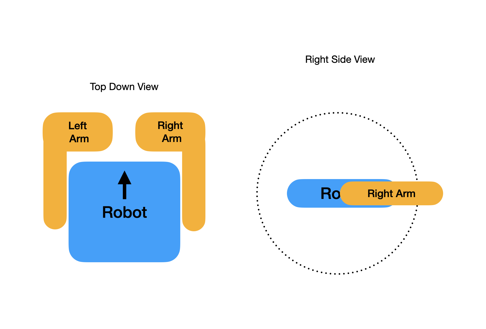

# Hopscotch

Firmware for a remote-controlled 4-wheel robot with two arms and an experimental self-balancing mode. Runs on an ESP32-S3, controls six brushless motors over CAN bus, and is driven with a RadioMaster GX12 transmitter over ELRS.



## Hardware

| Component | Details |
|-----------|---------|
| MCU | [M5Stack AtomS3R](https://docs.m5stack.com/en/core/AtomS3R) — ESP32-S3, dual-core 240 MHz, 8 MB flash, 8 MB PSRAM, 128x128 IPS display |
| CAN Adapter | [Atomic CAN Base](https://docs.m5stack.com/en/atom/Atomic%20CAN%20Base) (CA-IS3050G isolated transceiver) |
| Drive Motors | 4x Robstride RS05 — CAN IDs 10, 20, 30, 40 |
| Arm Motors | 2x Robstride RS00 — CAN IDs 1, 2 |
| Transmitter | [RadioMaster GX12](https://www.radiomasterrc.com/) running ELRS |
| Receiver | ELRS RX, CRSF protocol at 420 kbaud via Grove port |

All six motors communicate over CAN 2.0B extended frames at 1 Mbps. The Atomic CAN Base has no built-in termination resistor — you must add 120 ohm between CAN_H and CAN_L at the bus endpoints.

## Features

### Driving

Tank-style arcade mixing maps throttle and steering sticks to differential wheel speeds. All four drive motors run in **CSP (Cyclic Synchronous Position)** mode with a closed-loop rolling position horizon. A three-state machine (Idle, Driving, Braking) handles smooth acceleration, coast-down, and position hold. If the controller stops sending updates, the robot coasts to a stop within 3 seconds.

### Arms

Two arm motors are driven in rate mode — stick input is integrated into a position target clamped to a configurable range. Arms support calibration, programmable positions (nudge/jump), and are used by the balance controller to tip the robot upright.

### Self-Balance Mode

An optional balancing mode activated via RC switch combinations. A 200 Hz complementary-filter + PD control loop runs on Core 0 and commands the rear drive wheels while the front wheels hold position. The arms tip the body up, then the controller takes over to maintain balance. Safety monitors (tilt limits, sustained error, excessive roll rate, motor saturation, stuck detection) automatically disengage the balance mode if the robot is falling.

### Web Dashboard

The robot creates a WiFi access point (default SSID: `Hopscotch`) and serves a web UI on port 80 with:

- Live 10 Hz telemetry over WebSocket — motor positions, velocities, torques, temperatures, all 16 RC channels, arming state, link quality
- REST API for reading/writing settings, emergency disarm, CAN ID reassignment, and factory reset
- All settings are persisted to flash as JSON

### Serial Console

A serial CLI at 115200 baud provides debug output every 2 seconds (loop timing, per-motor feedback, drive states, CAN health) and supports real-time tuning of balance gains.

## Transmitter Setup

The RadioMaster GX12 should be configured with ELRS and the following default channel mapping:

| Function | Channel | GX12 Control |
|----------|---------|-------------|
| Steering | CH1 | Right stick X |
| Throttle | CH2 | Right stick Y |
| Arm Speed | CH5 | Left slider |
| Arm Nudge | CH4 | Right slider |
| Arm Select Group | CH6 | 3-way switch |
| Arm Select Variant | CH7 | 3-way switch |
| Arms Arm/Disarm | CH9 | Lighted button |
| Drive Arm/Disarm | CH10 | Switch |
| Arm Trigger Execute | CH11 | Trigger button |
| Arm Trigger Home | CH12 | Trigger button |
| Left Arm | CH13 | Knob |
| Right Arm | CH14 | Knob |

Channel assignments are fully configurable through the web dashboard. Signal loss is detected if no valid CRSF frame arrives within 500 ms — all motors hold position on failsafe.

## Building and Flashing

### Prerequisites

- [PlatformIO](https://platformio.org/) (CLI or IDE plugin)
- USB-C cable to the AtomS3R

### Build

```bash
pio run
```

Or use the helper script:

```bash
./scripts/build.sh
```

### Flash Firmware

```bash
pio run --target upload
```

Upload uses `esp-builtin` (JTAG) because the AtomS3R's USB-JTAG serial port is unreliable with esptool baud rate changes while firmware is running.

### Upload Web UI

The web dashboard files in `data/` must be uploaded separately to LittleFS:

```bash
pio run --target uploadfs
```

### Serial Monitor

```bash
pio device monitor
```

Or:

```bash
./scripts/monitor.sh
```

## Software Architecture

The firmware runs two cores of the ESP32-S3:

- **Core 1** — Main 50 Hz control loop: CRSF parsing, arming logic, drive controller, arm controller, balance state machine, failsafe, display, WebSocket telemetry
- **Core 0** — 200 Hz balance tick: IMU read, complementary filter, PD loop, wheel position commands (only active during balance mode)

### Module Map

| File | Responsibility |
|------|---------------|
| `main.cpp` | Setup, main loop, arming, failsafe, debug output |
| `config.h` | Pin definitions, timing constants, tuning parameters |
| `settings.h/cpp` | Persistent JSON configuration on LittleFS |
| `robstride.h/cpp` | Low-level Robstride CAN protocol driver (TWAI) |
| `motor_manager.h/cpp` | Six-motor management, arming FSM, feedback routing |
| `crsf.h/cpp` | CRSF packet parser, channel extraction, link detection |
| `drive_controller.h/cpp` | Arcade mixing, rolling position horizon, braking |
| `arm_controller.h/cpp` | Rate-mode arm control with calibration |
| `balance_controller.h/cpp` | Balance state machine and 200 Hz PD loop |
| `display.h/cpp` | 128x128 sprite-based status display |
| `web_server.h/cpp` | Async web server and WebSocket telemetry |

### Timing

| Task | Rate |
|------|------|
| Control loop | 50 Hz |
| Balance loop | 200 Hz |
| Display refresh | 25 fps |
| WebSocket telemetry | 10 Hz |
| CRSF telemetry uplink | 5 Hz |

## Configuration

Compile-time defaults live in `src/config.h`. Most parameters can be overridden at runtime through `settings.json` (persisted to LittleFS) via the web dashboard or REST API.

Balance gains can also be tuned live over serial without reflashing:

```
bal kp 1.2
bal kd 0.15
bal base 89.0
bal pkp 0.2
```

See `docs/PROJECT.md` for the full Robstride CAN protocol reference and detailed documentation.

## License

MIT
