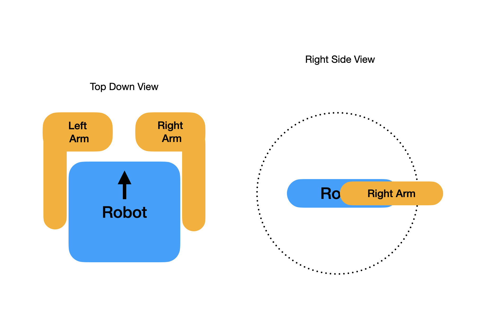

# Hopscotch

Firmware for a remote-controlled 4-wheel robot with two arms and an experimental self-balancing mode. Runs on an ESP32-S3, controls six brushless motors over CAN bus, and is driven with a RadioMaster GX12 transmitter over ELRS.

**First successful early-recovery stand-up — September 14, 2026:** [Findings, firmware changes and measured result](docs/BALANCE_STARTUP_RECOVERY_2026-09.md) · [Current state](docs/progress/CURRENT.md) · [Test procedure](docs/BALANCE_TESTING.md). Austin reports a successful unaided start; the complete 1,203-sample log records early recovery and settling. Peak initial wheel speed was 82% lower than the previous assisted attempt. Preserve the tested firmware while measuring repeatability. [Exact firmware identity](evidence/balance-startup-recovery/tested-firmware-identity.json).



## Hardware

| Component | Details |
|-----------|---------|
| MCU | [M5Stack AtomS3R](https://docs.m5stack.com/en/core/AtomS3R) — ESP32-S3, dual-core 240 MHz, 8 MB flash, 8 MB PSRAM, 128x128 IPS display |
| CAN Adapter | [Atomic CAN Base](https://docs.m5stack.com/en/atom/Atomic%20CAN%20Base) (CA-IS3050G isolated transceiver) |
| Drive Motors | 4x Robstride RS05 — CAN IDs 10, 20, 30, 40 |
| Arm Motors | 2x Robstride RS00 — CAN IDs 1, 2 |
| Transmitter | [RadioMaster GX12](https://www.radiomasterrc.com/) running ELRS |
| Receiver | ELRS RX, CRSF protocol at 420 kbaud via Grove port |

All six motors communicate over CAN 2.0B extended frames at 1 Mbps. The Atomic CAN Base has no built-in termination resistor — you must add 120 ohm between CAN_H and CAN_L at the bus endpoints.

## Features

### Driving

Tank-style arcade mixing maps throttle and steering sticks to differential wheel speeds. All four drive motors run in **CSP (Cyclic Synchronous Position)** mode with a closed-loop rolling position horizon. A three-state machine (Idle, Driving, Braking) handles smooth acceleration, coast-down, and position hold. If the controller stops sending updates, the robot coasts to a stop within 3 seconds.

### Arms

Two arm motors are driven in rate mode — stick input is integrated into a position target clamped to a configurable range. Arms support calibration, programmable positions (nudge/jump), and are used by the balance controller to tip the robot upright.

### Self-Balance Mode

An optional balancing mode activated via RC switch combinations. At the start of the tip-up sequence the rear wheels are switched from CSP position mode to Robstride Speed mode (while the robot is still static on all fours): a 200 Hz complementary-filter + PD control loop commands wheel velocity directly, while the front wheels hold position in CSP. A 50 Hz outer cascade (position P -> velocity PI) adjusts the tilt setpoint to hold station. During arm return, sustained rising wheel speed triggers a short, bounded boost to the existing equilibrium-learning integral. Recovery first targets zero wheel speed, retains its learned correction through the arm handoff, then captures the settled location for position holding. Starts without a recovery event retain the original position reference.

The balance point is self-calibrating: an arm-position-to-balance-point curve provides the shape, every settled capture re-zeros its absolute level, and a persisted trim learns residuals from recent calm intervals across runs. Movement of the sensor relative to the chassis during a run remains an unresolved physical uncertainty. The arms double as a second balance actuator: from their top-dead-center stance they throw against pushes through an engagement lifecycle (fast attack, one recoil handoff, calm-gated re-arm) intended to limit repeated self-triggering during disturbances, with a full-stop emergency throw when the wheels saturate. Safety systems include tilt/rate/saturation aborts, stale-feedback abort, CAN bus-off recovery, motor-side CAN watchdogs, a two-stage dead-man on the control heartbeat, and level-based disarm enforcement.

The full design record -- 30+ instrumented runs and 50+ lessons in the current Speed-mode campaign -- lives in `telemetry_logs/TUNING_HISTORY.md`. Offline tooling: `scripts/fit_balance_model.py --speed-only` fits the plant model from telemetry, and `scripts/balance_sim.py` is an approximate planar simulator (capture/arm-return scenarios, push response, control-task stall injection) used to screen controller changes before robot time. It reads current firmware constants but does not simulate full self-righting, contacts, slip, sensor mounting movement, or the actual task scheduler. The repeatable flash, safety, test, marker, download, and analysis workflow is in [`docs/BALANCE_TESTING.md`](docs/BALANCE_TESTING.md).

### Web Dashboard

The robot creates a WiFi access point (default SSID: `Hopscotch`) and serves a web UI on port 80 with:

- Live 10 Hz telemetry over WebSocket — motor positions, velocities, torques, temperatures, all 16 RC channels, arming state, link quality
- REST API for reading/writing settings, emergency disarm, CAN ID reassignment, and factory reset
- All settings are persisted to flash as JSON

### Serial Console

A serial CLI at 115200 baud provides debug output every 2 seconds (loop timing, per-motor feedback, drive states, CAN health) and supports balance-gain tuning between attempts. Active runs accept only disarm, status, notes and markers, so the saved gain snapshot remains meaningful.

## Transmitter Setup

The RadioMaster GX12 should be configured with ELRS and the following default channel mapping:

| Function | Channel | GX12 Control |
|----------|---------|-------------|
| Steering | CH1 | Right stick X |
| Throttle | CH2 | Right stick Y |
| Arm Speed | CH5 | Left slider |
| Arm Nudge | CH4 | Right slider |
| Arm Select Group | CH6 | 3-way switch |
| Arm Select Variant | CH7 | 3-way switch |
| Arms Arm/Disarm | CH9 | Lighted button |
| Drive Arm/Disarm | CH10 | Switch |
| Arm Trigger Execute | CH11 | Trigger button |
| Arm Trigger Home | CH12 | Trigger button |
| Left Arm | CH13 | Knob |
| Right Arm | CH14 | Knob |

Channel assignments are fully configurable through the web dashboard. Signal loss is detected if no valid CRSF frame arrives within 500 ms — all motors hold position on failsafe.

## Building and Flashing

### Prerequisites

- [PlatformIO](https://platformio.org/) (CLI or IDE plugin)
- USB-C cable to the AtomS3R

### Build

```bash
pio run
```

Or use the helper script:

```bash
./scripts/build.sh
```

### Flash Firmware

```bash
pio run --target upload
```

Upload uses `esp-builtin` (JTAG) because the AtomS3R's USB-JTAG serial port is unreliable with esptool baud rate changes while firmware is running.

### Upload Web UI

The web dashboard files in `data/` must be uploaded separately to LittleFS:

```bash
pio run --target uploadfs
```

For a balance-test firmware update, do not run `uploadfs` unless the web assets actually changed: it can replace the LittleFS volume that holds settings, arm calibration, and the saved balance log.

### Serial Monitor

```bash
pio device monitor
```

Or:

```bash
./scripts/monitor.sh
```

## Software Architecture

The firmware splits the two ESP32-S3 cores into a **control core** and a **comms core**:

- **Core 1 (control)** — three tasks by priority: a stall-forensics sentinel (prio 24), the 200 Hz balance task (prio 18: direct IMU acquisition, complementary filter, PD loop, wheel speed commands), and the 50 Hz control task (prio 12: serial console, CRSF parsing, CAN scan/feedback, arming logic, drive/arm/balance controllers, failsafe). The Arduino `loopTask` (prio 1) keeps only the display, WebSocket telemetry, and debug output — control can preempt it, never the reverse.
- **Core 0 (comms)** — WiFi and lwIP (pinned there by the framework) plus `async_tcp` (pinned by build flag). Networking can no longer preempt the control loops.

Control-task gaps over 100 ms are recorded as forensic events (profiler section attribution plus a sentinel-gap discriminator). The profiler is reset at balance entry and frozen at exit, so `bal log` reports only the physical run rather than idle-time download activity.

Balance telemetry schema v2 records up to 120 seconds at 50 Hz, including tip-up, in PSRAM, including 200 Hz inner-loop timing/saturation aggregates, raw and filtered IMU signals, all setpoint components, unclamped/applied commands, CAN feedback latency, wheel and arm torque/motion, arm-assist lifecycle, yaw correction, power, safety-exit reason, and operator event markers. It is persisted as a checksummed binary file only after balance ends and drive and arms are both disarmed, and exported to validated CSV by `./scripts/save_telemetry.sh`.

### Module Map

| File | Responsibility |
|------|---------------|
| `main.cpp` | Setup, main loop, arming, failsafe, debug output |
| `config.h` | Pin definitions, timing constants, tuning parameters |
| `settings.h/cpp` | Persistent JSON configuration on LittleFS |
| `robstride.h/cpp` | Low-level Robstride CAN protocol driver (TWAI) |
| `motor_manager.h/cpp` | Six-motor management, arming FSM, feedback routing |
| `crsf.h/cpp` | CRSF packet parser, channel extraction, link detection |
| `drive_controller.h/cpp` | Arcade mixing, rolling position horizon, braking |
| `arm_controller.h/cpp` | Rate-mode arm control with calibration |
| `balance_controller.h/cpp` | Balance state machine and 200 Hz PD loop |
| `display.h/cpp` | 128x128 sprite-based status display |
| `web_server.h/cpp` | Async web server and WebSocket telemetry |

### Timing

| Task | Rate |
|------|------|
| Control loop | 50 Hz (5 ms task cadence) |
| Balance loop | 200 Hz |
| Display refresh | 25 fps (5 fps while balancing) |
| WebSocket telemetry | 10 Hz (1 Hz while balancing) |
| CRSF telemetry uplink | 5 Hz |
| Stall sentinel | 100 Hz |

## Configuration

Compile-time defaults live in `src/config.h`. Most parameters can be overridden at runtime through `settings.json` (persisted to LittleFS) via the web dashboard or REST API.

Balance gains can also be tuned over serial between attempts without reflashing:

```
bal kp 2.0      # inner PD: rad/s wheel speed per deg of angle error
bal kd 0.08     # inner PD: rad/s per deg/s of roll rate
bal dkp 0.05    # outer: target return velocity per rad of drift
bal vkp 2.2     # outer: high-slope setpoint response per rad/s of velocity error
bal vki 0.35    # outer: integral gain (the single equilibrium learner)
bal note test-name  # tag the next/current telemetry capture
bal mark        # add a numbered event marker (CH12 does this while balancing)
```

See `docs/PROJECT.md` for the full Robstride CAN protocol reference and detailed documentation.

## License

MIT
