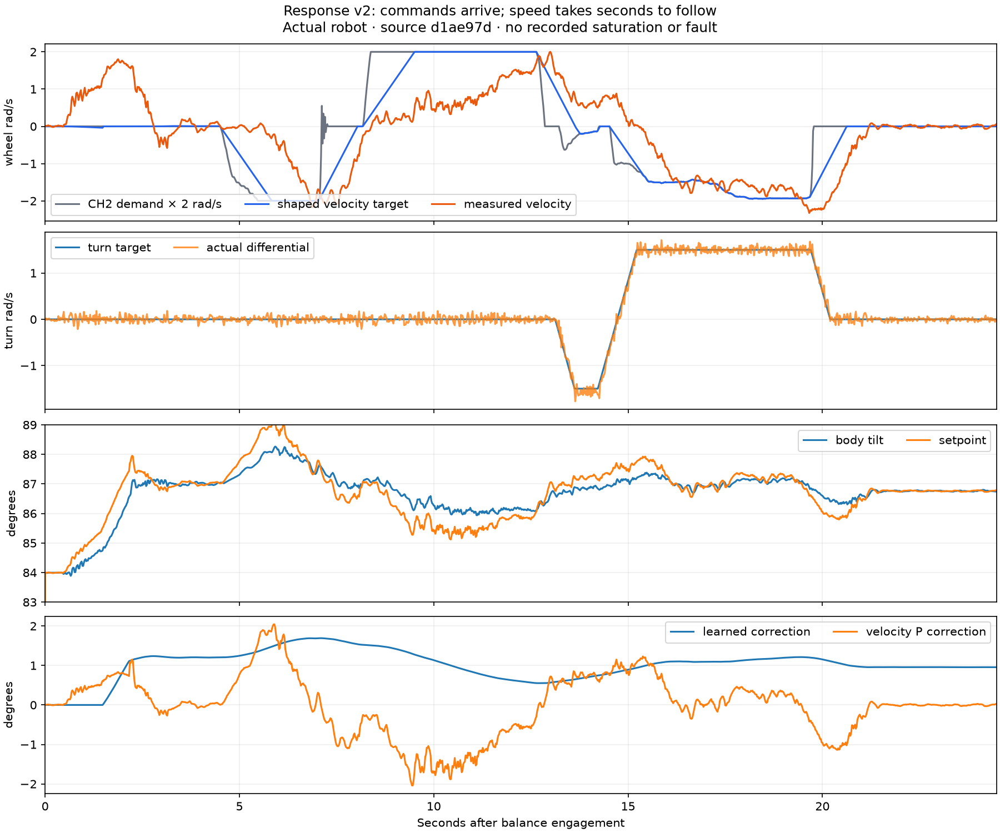

# Standing drive: acceleration control and planned arm assistance

> **Historical record:** this document describes the dated release or trial below. For the installed firmware, see [current state](progress/CURRENT.md). Use [OTA updates and Wi-Fi telemetry](WIFI_OTA.md) and the [current test guide](BALANCE_TESTING.md) for new work. Older package paths, app0-only USB commands and “next” actions below are preserved as history; they are not instructions for updating the current robot.

September 19, 2026. Austin requested 10× the installed forward/back limit, 3× the turning limit, and immediate response even at full stick. He also proposed using the arms to initiate lean and help acceleration/braking. This candidate implements those requests. Physical performance is still unverified; the exact release identity and deployment state are in [CURRENT](progress/CURRENT.md).

## What the latest physical run establishes

Retrieved the complete response-v2 run: [1,666 samples](../telemetry_logs/bal_20260919_181555_drive-response-v2-delayed.csv), 33.304 seconds between first/last samples, including 24.480 seconds in BALANCE. The file identifies the installed `d1ae97d` build, schema 3/features 255, note `standing-drive-response-v2`. Binary checksum `0x298924B0`, USB checksum `0x72A5CE52`; matching raw transfer retained.

Full reverse first appears 5.280 seconds after engagement; measured average wheel speed reaches −1 rad/s at 6.360 seconds. Full forward begins at 8.360 seconds, reaches +1 rad/s at 11.420 seconds (3.06 seconds later), and +1.8 rad/s at 12.680 seconds (4.32 seconds later). The request limit was ±2 rad/s. During the forward delay, speed stalls around 0.5 rad/s while the learned angle correction changes. These intervals include the command ramp and the preceding direction change; they are not isolated step-response identification trials.

There are zero recorded saturation, setpoint-clamp, IMU-fault or CAN-transmit-fault rows. Maximum inner interval is 5.016 ms, maximum logged IMU age 9 ms, rear feedback age at most 2 ms after the first 50 ms of BALANCE. Maximum angle error is 1.055°. No arm recovery was active. Final two seconds average wheel-speed RMS is 0.0326 rad/s. Turning follows the ±1.5 rad/s differential requests. This confirms the reported delayed response, but does **not** support a literal actuator saturation explanation. Stronger low-error P in v2 was insufficient; simply raising its speed ceiling is not an adequate fix.



At USB retrieval the device was IDLE with both groups disarmed and no pending save. Stored trim was 3.33°, calibrated center/back deltas retained, IMU healthy. Receiver link was absent and all motor receive counters were zero, consistent with motor/receiver power being off. Live CAN transmit errors from that USB-only session are not evidence of faults in the earlier moving run. Likewise the exported profiler has `live` scope after reboot, not the prior trial's task timing. The older `balance-drive-response/first-trial.serial` observer expired during idle and did not record this test.

## Firmware changes

| Setting | Installed v2 | Candidate v3 |
|---|---:|---:|
| CH2 average wheel request limit | ±2 rad/s | ±20 rad/s |
| CH1 per-wheel turn request limit | ±1.5 rad/s | ±4.5 rad/s |
| Speed reference acceleration / braking | 1.5 / 2 rad/s² | 12 / 16 rad/s² |
| Turn reference slew | 3 rad/s² | 18 rad/s² |
| Planned arm excursion | none | ±0.10 center-axis fraction |

The reference ramp reaches +20 rad/s from zero in about 1.67 seconds, returns its reference to zero in 1.25 seconds, and reaches full turn in 0.25 seconds. These are command-shaping times, **not** measured physical acceleration or stopping times. Steering now uses its dedicated limit: the stationary heading-hold clamp remains ±1.5 rad/s and cannot silently clip a requested ±4.5 turn. The final wheel mixer still gives balance priority and clips turning to the remaining ±30 rad/s wheel headroom.

After the existing neutral/calm unlock, driving uses a 200 Hz acceleration feedback controller. Its output is integrated into the wheel velocity command, seeded from the previous command for continuity:

```
a = 8.8 × angle_error − 3.1 × body_rate
    + 3.0 × clamp(measured_speed − requested_speed, −8, +8)
wheel_command += clamp(a, −100, +100) × dt
```

Body angle/rate are degrees and degrees/second; wheel quantities use physical radians. The stored command is clamped to the available wheel limit, preventing actuator windup. A speed request produces a lean-initiating wheel acceleration immediately, without waiting for the equilibrium estimate to change. The ±8 rad/s travel-error bound leaves angle/rate feedback the full motor acceleration authority to catch lean. Capping the combined balance acceleration to a small travel acceleration failed model catch tests and was rejected.

While this controller is active, the former speed-error-to-angle P term is zero. The existing equilibrium integral only learns when speed error is below 1 rad/s, so intentional acceleration does not become a large false equilibrium correction. There is still one equilibrium estimator; the new integrated variable is the actuator's velocity reference. Sticks centered requests braking; the controller remains active until the existing 400 ms measured calm stop gate passes, then slews its output into the original stationary PD at at most 30 rad/s². Stand-up, early runaway learning, recoil release and never-driven stationary control retain their prior behavior. A subsequent stop can naturally have a different learned equilibrium/arm state from before driving.

Planned arm assistance is proportional to the **change in requested velocity**: `−0.008333333 × requested_acceleration`, limited to ±0.10 of each calibrated center-axis delta and smoothed with an 80 ms time constant before the existing arm output filter. The measured calibration makes this about 10° per shoulder. It reverses for braking and relaxes during steady requests. This is a small transient center-of-mass shift intended to help initiate lean; its physical contribution and sign must be confirmed in the robot test, including inertial reaction that the model does not fully represent. The actual measured arm pose continues to adjust the balance-point schedule. Calibrations, arm speed ceiling and recovery excursion limits are unchanged.

Existing active or recoil arm catches take priority over planned movement. During driving, a measured speed between zero and the requested speed is treated as expected acceleration, rather than a disturbance requiring a full arm throw. Overspeed, motion in the wrong direction and braking lag still produce arm recovery error; emergency arm recovery uses that same disturbance error. This avoids treating a large deliberate 20 rad/s request as a runaway merely because the wheels have not reached it yet. The implementation and host tests share the priority, sign and yaw-selection helpers.

The existing input freshness, neutral re-entry, arm/drive arming, tilt/rate/feedback, saturation and heartbeat gates remain. No tool arms motors or initiates a stand-up.

## Telemetry and compatibility

Schema 4 appends `pilot_arm` after the exact 236-byte schema-3 prefix: 240 bytes/sample, 6,000 samples, 1,440,000 bytes in PSRAM, plus a 388-byte saved header. Existing LittleFS partition size remains 1,572,864 bytes. Features are 511; new bit 256 identifies acceleration control/planned arms. `pilot_flags` bit 16 records acceleration control or the transition back to PD. `pilot_arm` records the planned fraction after recovery priority, before the final arm output filter; actual pose, target and total assistance remain in the existing fields.

Exports still read schema 2/220 and schema 3/236, preserving historical algorithm limits and checksums. Unavailable new fields are blank, not fabricated zeros. Host validation accepts blanks only for older versions, verifies transport integrity and handles full 6,000-sample schema-4 transfers. The old v2 firmware cannot read new schema-4 files: **download a candidate run before restoring v2**.

## Checks and limits of evidence

Seven native test executables and 25 Python tests pass, covering production controller math, input loss/re-entry, arm sign/priority, actual steering selection, motor setup/feedback, CRSF, anti-windup, bounded PD transition and log compatibility. Consolidated syntax/whitespace checks and ESP32-S3 build pass: 1,143,661 flash bytes, 50,832 static RAM bytes; application image 1,144,032 bytes. Build and source-hashed screening evidence are retained in [the evidence directory](../evidence/balance-drive-agility/README.md).

All 324 complete neutral model trajectories match installed v2 exactly. Three additional 54-case screens use short ±15% stick inputs, sustained full forward/reverse, and input freshness loss. Candidate and baseline each have 9 falls per profile; there are zero new candidate failures. Only 34/38/31 cases respectively actually unlock and command driving; cases that never unlock are not successful drive trials. The screen invokes the actual C++ pilot and acceleration controller, while the surrounding arm/outer dynamics are modeled in Python.

In the nominal full-input model case, mean forward speed during seconds 20–26 is 19.71 rad/s, peak speed 20.69 rad/s, and speed RMS during seconds 30–35 (4–9 seconds after release) is 0.65 rad/s. Final RMS is 0.21 rad/s. Short-input/input-loss final RMS remains 1.32/1.58 rad/s, so this screen is not evidence of precise physical stopping. The coarse July-fitted model has roughly 2 rad/s stationary ripple on v2, versus the real run's 0.033 rad/s; it omits yaw, tire slip, contact, battery/current constraints and full arm reaction. No speed in meters/second or turning rate is claimed without measured geometry.

Earlier reference-governor, stronger-P/damping and low-acceleration prototypes were rejected for new falls or persistent braking lag. One zero-new-fall variant still rolled around 9 rad/s six to ten seconds after stick release. None of those variants was flashed. Archived prototype results are exploratory; `screen.py` is the final source-backed comparison.

## First test and restoration

Use normal stand-up with CH1/CH2/CH4 neutral, CH7/CH9/CH10 HIGH and one CH11 pulse after arming. Let it settle, keep sticks centered for a second, then make one brief ~10% forward input and center until stopped; repeat backward, then steering separately. Ten percent CH2 now requests about 0.85 rad/s after the 6% deadband. Avoid full-stick tests until small inputs and stopping are demonstrated. End promptly if it runs away or needs support; lower both CH9 and CH10 and retain power/USB for the log. Skip taps during this response test.

Exact application package: `artifacts/balance-drive-agility/`. Upload only its application at `0x10000`, using the existing prepared-package flasher. Preserve bootloader, partitions, NVS, calibration and LittleFS. Before upload, check fresh disarmed status and preserve any new saved/pending run. The latest physical v2 log above is already downloaded. Verify retained calibration/trim, allocation and firmware identity after upload; powered motor/receiver health is a separate required check before a moving test.

Restore the known response-v2 application with `--package artifacts/balance-drive-response --flash` after downloading candidate data. Do not use `--rollback`, which selects an older historical baseline. Previous stand-only recoil-release and first standing-drive packages, plus the original full 8 MB device backup, remain available.


## Verified upload

Source `5a07ebabef8f6431e8a9908fa4b53170b24a2308`, image SHA-256 `75ccdb4412dc3ebd0e4cc567cde845ab6bb3107d7d105e7fdcf69f4b2afa8118` was programmed and verified at application offset `0x10000`. A USB reconnect during operator power preparation occurred before programming; a new disarmed preflight passed. After flashing: receiver linked, both groups disarmed, six motors online/error-free, 25.2 V, calibration and 3.33° trim retained, IMU age 5.997 ms with no fault, CAN receive misses/transmit failures/bus errors zero. The live status reports 20/4.5 rad/s limits and schema 4. The boot allocation message was not captured; buffer operation remains to be demonstrated by the first new run.

The stored v2 run was reexported through v3 and all 1,666 original sample fields and stored controller metadata match exactly, including binary checksum `0x298924B0`. New `pilot_arm` values are blank as intended; the changed CSV transport checksum is `0xA5D84DD1`. `bal_20260919_184914_v2-export-on-drive-agility` is a compatibility copy, not a new trial. Frozen package and prior restore package both verify. No tool-initiated motion, calibration reset or filesystem upload. Operator physical test remains pending.


**Physical results supersede the pending-test status above:** [two trials and analysis](BALANCE_DRIVE_TRIALS_2026-09-19.md) archive one failed stand-up followed by a successful stand-up with faster but oscillatory driving. A damping/braking correction is needed before further full-speed testing. Same source/image remains installed.
