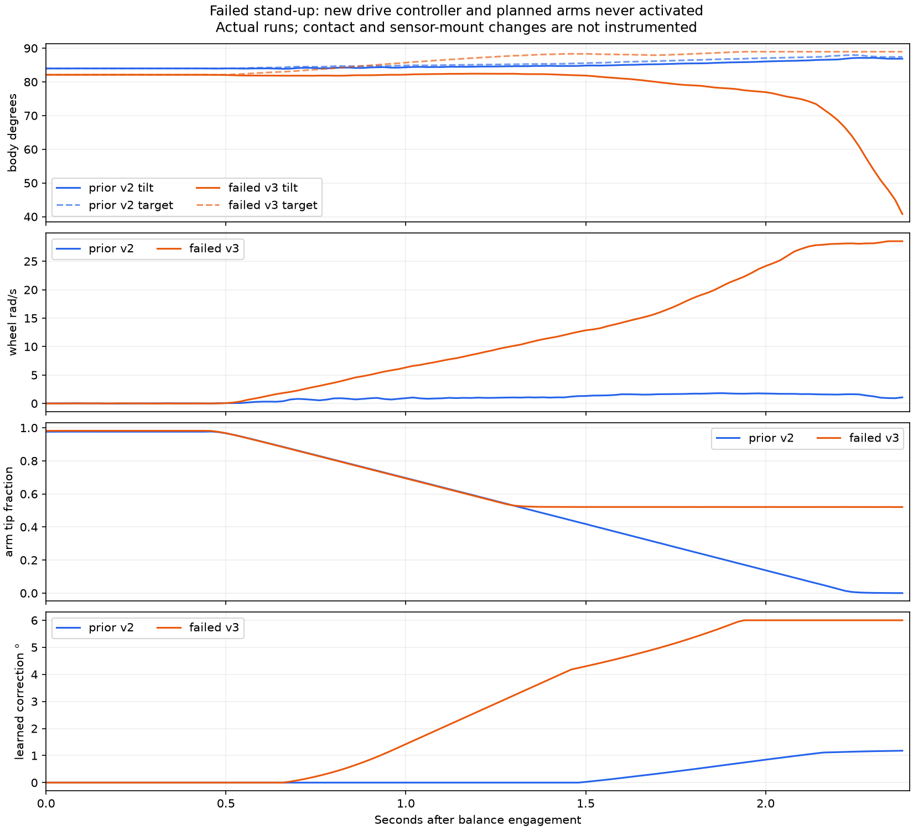
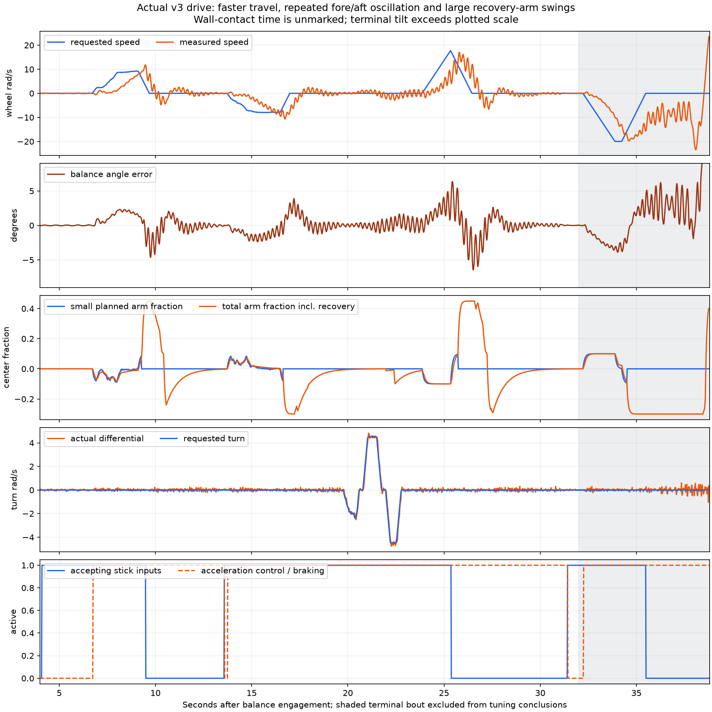

# First physical acceleration-drive trials

Both runs used the same uploaded source `5a07ebabef8f6431e8a9908fa4b53170b24a2308`, application `75ccdb4412dc3ebd0e4cc567cde845ab6bb3107d7d105e7fdcf69f4b2afa8118`, build time 18:42:41. No firmware or gain change occurred between them or during this analysis. The user first reported a stand-up runaway, then a successful stand-up with substantial front-to-back rocking while driving and a final wall contact. Both logs were saved before another run could overwrite them; both post-run checks found drive and arms disarmed.

## Failed stand-up

Complete [561-row capture](../telemetry_logs/bal_20260919_185202_drive-agility-standup-runaway.csv): 11.204 seconds total, 2.380 seconds in BALANCE. Binary `0x50545AF6`, transport `0x0A0FFD86`; schema 4/features 511. The saved buffer is operating. End reason is `bailout_angle_error`.

The new pilot never became ready or moving, acceleration-controller bit 16 never appeared, and planned arm fraction stayed zero. The raw wheel command matches the original `2 × angle_error − 0.08 × body_rate` law within 0.00264 rad/s using rounded logged inputs. A reverse-stick movement began 1.60 seconds after engagement, after the runaway was already underway; it was rejected by the startup gate. This is not evidence that reverse input caused the event.

Arms began returning at 0.42 seconds. Early wheel recovery triggered at 0.68 seconds; wheel command crossed the existing 10 rad/s crisis threshold at 1.26 seconds, pausing arm return near 0.52 tip fraction. Equilibrium correction reached its 6° limit, speed continued rising, and tilt bailout ended the attempt. Peak filtered speed was 28.53 rad/s and wheel travel 26.60 rad. Recorded inner intervals in BALANCE were at most 5.326 ms, with no IMU-fault or CAN-TX-fault rows. The 19 ms maximum IMU age across the entire file includes outside-BALANCE samples; BALANCE maximum is 9 ms.

Captured tilt was 82.112°, versus 83.992° in the preceding successful v2 run and 85.329° in the next successful v3 stand-up. The two v3 runs began with nearly identical raw accelerometer angles, −2.012° and −1.913°, yet captured poses differed by 3.217°. This does **not** establish a simple fixed sensor-offset cause. Initial arm pose, support/contact geometry, movement of the sensor during tip-up, and the limitations of calibrating equilibrium from a supported capture remain unresolved. Reverting the driving-only gains is not supported as a stand-up fix by this trace. The original startup recovery is not robust across these observed captures.

## Successful stand-up, oscillatory driving

Complete [2,381-row capture](../telemetry_logs/bal_20260919_185559_drive-agility-wobble-wall.csv): 47.604 seconds total, 38.780 seconds in BALANCE. Binary `0x64EC16B9`, transport `0x58692019`. The user confirmed the wobble was all front-to-back rocking. No contact marker identifies the exact wall time, so the final drive bout from 32 seconds onward is excluded from tuning conclusions below. That is an analysis boundary, not a detected impact timestamp. The recording ends with tilt bailout, not an explicit drive-disarm end reason.

The robot became ready for driving at 4.10 seconds. Before the first command (4.2–6.5 seconds), tilt varied only 0.101° and filtered speed RMS was 0.065 rad/s. First forward input began at 6.74 seconds; measured speed exceeded 0.5 rad/s at 7.04 seconds, about 0.30 seconds later. This is evidence of quicker initiation, although the different stick trajectories mean it is not a controlled comparison with v2's full-stick tests. The requested ±4.5 rad/s turning range appears in the log and measured differential wheel speed follows it closely.

Stopping excites a fast rocking mode around 4–5 Hz. During the first stop (9.2–13.5 seconds), speed spans +11.83 to −4.75 rad/s and body tilt spans 5.27°. During seconds 17.5–20.5, requested forward speed is exactly zero, yet actual speed spans −1.42 to +2.50 rad/s and tilt spans 2.48°. Later turning with zero forward request still has fore/aft oscillation. The first strong ringing occurs without steering input, so turning alone cannot explain it. Frequency estimates describe windowed gyro data; they are not a fitted plant model.

The small planned arm movement stays within ±0.10 of the calibrated center delta (~10° at each shoulder). Total assistance repeatedly grows to +0.45/−0.30 (~46°/30°) because the existing disturbance-recovery path takes over. Ordinary recovery first activates at 9.28 seconds during braking, reaches the positive limit, then gives a recoil swing. Large arm motion and wheel-loop ringing occur together; the trace alone cannot separate cause and amplification. Ringing also persists with very small arm excursions, so planned arms alone do not explain it.

The emergency rule currently treats a common wheel command above 45% of the 30 rad/s ceiling (13.5 rad/s), together with more than ~2.12 rad/s disturbance error, as requiring a full arm throw. This threshold was inherited from slower operation but is below the new 20 rad/s cruising limit. At 25.74 seconds it activates with command 17.99, measured speed 14.41 and target 11.36 rad/s during braking. This establishes that full arm recovery can be invoked well below wheel saturation in ordinary high-speed deceleration. A drive-specific distinction between transient braking error and exhausted balance authority is needed.

The input acceptance gate drops at 9.50 and 25.38 seconds when recorded body rate exceeds the existing 30°/s threshold; fresh-input flags stay set. The controller then brakes and waits for centered calm before accepting more input. These pauses are responses to the rocking, not recorded radio dropouts. There are no recorded IMU-fault or CAN-TX-fault rows, and no wheel saturation before the excluded terminal bout. BALANCE inner timing maximum is 5.484 ms (5.514 ms across the whole file).

## Recommended next change

1. Retune the driving feedback loop against the measured 4–5 Hz oscillation, targeting a better-damped response and accounting for sensor/motor delay. Do not assume that increasing derivative gain automatically adds damping: the current gain acts in an acceleration controller with filtered feedback. The original offline model did not reproduce this physical mode well enough.
2. Ease acceleration/braking reference ramps while retaining the requested 20/4.5 rad/s speed/turn limits. The current 12/16 rad/s² ramps provoke substantial transient error. A first screening value of 6/8 would remain much faster than v2 but is a proposal, not validated tuning.
3. Grade ordinary braking-arm assistance and revise the **driving-only** full-throw trigger to consider actual balance headroom and worsening body motion. Preserve true emergency recovery and the unchanged startup behavior. Keep planned arm travel modest; do not respond to the observed overshoot by increasing arm range.
4. Add these real traces to validation, including zero-forward-request turning, repeat braking/reversal and the startup capture variation. A simulation result that misses the physical oscillation is insufficient evidence for another aggressive upload.

No additional firmware changes or flash were made after these runs. Robot remains disarmed; further full-speed testing is deferred until a damping/braking correction is prepared. Stand-up repeatability remains a separate unresolved issue, even though the second attempt succeeded.

Analysis scripts, checksummed transfers, metrics and figures are in [the evidence directory](../evidence/balance-drive-agility/README.md). The exact installed image and v2 restore package remain preserved.
