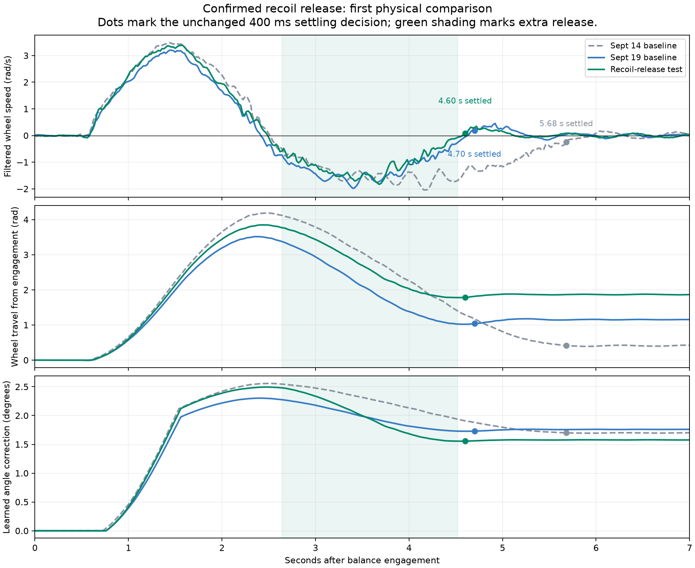

# Confirmed recoil release — September 19 candidate

> **Historical record:** this document describes the dated release or trial below. For the installed firmware, see [current state](progress/CURRENT.md). Use [OTA updates and Wi-Fi telemetry](WIFI_OTA.md) and the [current test guide](BALANCE_TESTING.md) for new work. Older package paths, app0-only USB commands and “next” actions below are preserved as history; they are not instructions for updating the current robot.

Austin authorized implementing and uploading the settling experiment after two successful starts. The baseline is source `720f2e31939a249a215b2b7f7c197130f2301310`, application SHA-256 `5531c6287dd5ef8d398d426a7596d8c6d91e6c914825d137bc9a1ef485734e35`, retained in `artifacts/balance-startup-recovery/`.

## Measured reason for the change

The successful September 14/19 runs stop forward motion at 2.525/2.420 s after engagement but finish recovery at 5.681/4.700 s. Their reverse speed reaches about −2 rad/s while the accumulated angle correction relaxes from 2.557/2.302° at the first stop to 1.700/1.730° at settling. This is consistent with excess transient correction, but does not isolate it from body dynamics or velocity-P damping. [The preceding review](BALANCE_SETTLING_REVIEW_2026-09-19.md) records the evidence and limitations.

## Exact firmware change

The same equilibrium integral now releases faster only during confirmed recoil:

- Startup recovery must still be active, the measured arm/base ramp complete, and both wheel samples at most 30 ms old.
- Wheel velocity must oppose the existing integral, reach 0.35 rad/s, and maintain that direction/threshold for 60 ms. Direction changes and stale/invalid timing reset confirmation.
- The multiplier rises linearly from 1 to 2 over 120 ms. Ordinary Ki is 0.231, so the fully enabled release Ki is 0.462. Below 0.15 rad/s, it blends back toward 1 over 120 ms; a changed direction or leaving recovery removes the multiplier immediately without resetting the integral.
- Extra release can remove the existing correction but cannot accumulate extra correction of the opposite sign when crossing zero. Ordinary integration retains its original crossing behavior.
- Existing ±6° integral/offset limits, 6°/s learning-rate bound, anti-windup and feedback gate remain.

Initial trigger/800 ms catch, inner PD, arm schedule and return speed, calibration, stable balance gains, 400 ms calm confirmation and settled-position hold are unchanged. No second estimator or integral reset was introduced. Telemetry feature bit 32 and sample `flags` bit `0x01` identify this phase; the binary schema stays at 220 bytes/sample. Old saved logs retain their original metadata when downloaded through new firmware.

## Verification and limits

Production C++ helper tests exercise both recoil directions, confirmation, hysteresis, gain ramps, stale/invalid inputs, reset after recovery, and 50,000 bounded boosted updates, alongside the previous 50,000 ordinary updates. Model transition checks verify unchanged initial behavior and return to normal learning. The host analyzer reports the new phase only when feature bit 32 is present.

Replay of the production helper on the two successful logs first enables extra release at 2.630/2.560 s, after the first stop and ramp completion. Inputs are recorded from the old controller, including its integral; this verifies phase selection, **not the motion the new firmware will produce**.

The final mirrored policy was compared with the frozen two-success baseline across 324 plant-uncertainty cases:

| Metric | Baseline | Confirmed recoil release |
|---|---:|---:|
| Early / later model failures | 86 / 60 | 79 / 42 |
| New failures / rescued failures versus baseline | — | 0 / 25 |
| Surviving cases that declare settling | 126 | 140 |
| Median settling across each survivor cohort | 6.30 s | 5.58 s |

All 324 cases have identical commands and targets before ramp completion. Among the 120 cases that survive and settle in both versions, the paired median settling-time change is **0.0 s**. The changing-cohort median cannot be claimed as a general 0.72-second gain. These stress cases are not a measured failure probability; the model omits contact, flex, slip and actual CAN loss. Physical improvement remains unverified.

Reproduce with `evidence/balance-recoil-release/screen.py`; full scenario results and production replay are retained alongside it. The earlier ungated multiplier screen now explicitly loads frozen baseline source/config from Git, preserving its historical meaning after these edits.

## Release and physical comparison

Consolidated validation passed: all five native suites, 21 Python tests, Python/shell syntax and whitespace checks, and the pinned ESP32-S3 firmware build. Flash usage is 1,138,913 bytes; static RAM 50,768 bytes, with unchanged 1,320,000-byte PSRAM log. Application file is 1,139,280 bytes, SHA-256 `5d3465e0269f9df19065d1583de35d093b46f947fdd27e49ef0de0bbf28d4dd0`.

Validation and exact release identity are recorded in `evidence/balance-recoil-release/`. The new package is `artifacts/balance-recoil-release/`. Upload application only at `0x10000` after a fresh disarmed check; preserve NVS, LittleFS, partition table and bootloader.

To restore the two-success baseline, verify disarm and run:

```sh
.venv/bin/python scripts/flash_prepared_balance.py --package artifacts/balance-startup-recovery --flash
```

Do **not** add `--rollback`: that option selects the much older rebuilt `e8b1280` image.

For one comparison, use the usual forward arm position and neutral CH1/2/4; set CH7/9/10 HIGH, wait two seconds, then CH11 HIGH one second and LOW once. Support/disarm promptly on runaway. If it settles, leave it untouched for five seconds, then support and lower both CH9/10; keep battery/USB connected for retrieval. Compare forward and reverse speed, wheel excursion, time to sustained calm, and later drift against the two successful runs. Skip disturbance taps for this first comparison.

## Upload outcome

Flashed and verified source `1d80257e5609a173d9bbe104997eab1f9d4c7341`, application `5d3465e0269f9df19065d1583de35d093b46f947fdd27e49ef0de0bbf28d4dd0`, application only at `0x10000`. Fresh preflight confirmed both groups disarmed, no pending log and the prior 1,303-sample run already safely archived. OpenOCD verification passed.

After boot: IDLE, both groups disarmed, six motors online/no errors, calibrated center/back deltas and 3.51° learned trim retained. Forward coordinates reset to zero normally on boot; raw arm poses match preflash. IMU age 5.953 ms, tilt −1.9°, no fault; receiver max 446 µs, CAN receive misses/TX failures zero. Original saved log size remains 287,048 bytes. No tool arming, calibration reset or filesystem upload. Passive observer started with note `confirmed-recoil-release-v1`; onboard logging starts automatically at tip-up. Physical result remains pending.

## First physical result — complete, successful operator report

Austin ran the test while release documentation was being finalized, then reported “This worked great” and that it felt faster and looked good. The passive USB observer captured the actual attempt and completed after saving. No contact/assistance markers were supplied; the exact intervention history is not independently established.

Downloaded [all 1,241 samples](../telemetry_logs/bal_20260919_151011_confirmed-recoil-release-success.csv), spanning 25.349 s with 15.980 s of BALANCE. Binary checksum `0xCE65B6D9` and USB checksum `0xB8588771` validate. Feature flags 63, `confirmed-recoil-release-v1`, build `Sep 19 2026 15:04:50`; run profiler scope `balance_run`. End reason is deliberate drive disarm, not a recorded balance failure.

| Measured after balance engagement | Sept 14 baseline | Sept 19 baseline | New release |
|---|---:|---:|---:|
| Settled/hold declared | 5.681 s | 4.700 s | **4.600 s** |
| First forward stop | 2.525 s | 2.420 s | 2.500 s |
| First stop to settled hold | 3.156 s | 2.280 s | **2.100 s** |
| Peak backward filtered speed, magnitude | 2.043 rad/s | 1.984 rad/s | **1.830 rad/s** |
| Backward travel from peak to settled hold | 3.776 rad | 2.478 rad | **2.063 rad** |
| Peak initial forward travel | 4.186 rad | 3.516 rad | 3.848 rad |
| Five-second steady wheel-speed RMS | 0.117 rad/s | 0.068 rad/s | 0.067 rad/s |
| Five-second steady travel range | 0.049 rad | 0.035 rad | 0.023 rad |

The new run settles only **0.100 s / 2.1% sooner than the latest baseline**, and 1.081 s sooner than the first baseline. The stronger evidence in this comparison is reduced recoil: **7.8% lower peak backward speed and 16.7% less backward travel**, with similar steady speed variation. The five-second steady windows begin 0.5 s after each run's settling event and use equal durations. The 400 ms calm rule is unchanged, so the shorter time is not a relaxed classification threshold.

Not every metric improved: initial forward travel rose 9.4% versus the latest baseline, and initial peak average wheel speed rose 5.3% (3.291 → 3.467 rad/s). Net final displacement is 1.872 rad versus 1.145 rad; less rollback naturally leaves it farther forward when holding the settled position. Total accumulated absolute wheel travel to settling is only 1.7% lower (6.040 → 5.939 rad). Wheel radians are retained rather than converted using an unverified effective tire radius.

The initial trigger, last boosted sample and ramp-complete timings match the latest baseline at 0.780, 1.560 and 2.180 s. New release first enables at **2.640 s**, after the forward stop; its last enabled sample is 4.520 s. All 95 flagged samples are post-ramp, active recovery, opposed to the integral and use fresh feedback. The integral changes from 2.494° at the first stop to 1.556° at settling. Its sampled slope implies a median gain multiplier **2.000×** during meaningful recoil, confirming the new path actually ran as designed rather than merely appearing in metadata.

No arm assistance, saturation, recovery-limit, IMU-fault, CAN-transmit-failure rows or stall events. BALANCE inner interval max 5.017 ms, sample p99/max 20/21 ms, IMU age max 10 ms, rear feedback age at most 6 ms after the initial 50 ms. Actual receiver max 525 µs and control gap 5.431 ms. The generic whole-capture feedback max of 230 ms occurs during TIP_UP before rear motion feedback begins; it does not describe active balancing. The raw observer contains stop retries after disarm while motors were still moving; no contact marker identifies the cause, and the subsequent stationary check is clean.

Posttrial IDLE, both groups disarmed, six motors online/no errors, calibration retained, existing learner stored 3.57° trim, healthy IMU (5.855 ms), CAN receive misses/TX failures zero. All serial readers are closed. Firmware remains the exact flashed candidate; no further tuning/upload followed.

This is one encouraging physical comparison, not a measured reliability improvement. Starting trim and battery differ (minimum BALANCE voltage 24.63 V versus 25.09 V in the latest baseline). **Keep this image unchanged and repeat ordinary starts under similar conditions before increasing gains again.** Compare the same recoil/steady metrics, not just the settling timestamp. Raw transfers, observer, configuration differences, reproducible analysis and device checks are in `evidence/balance-recoil-release/`.


