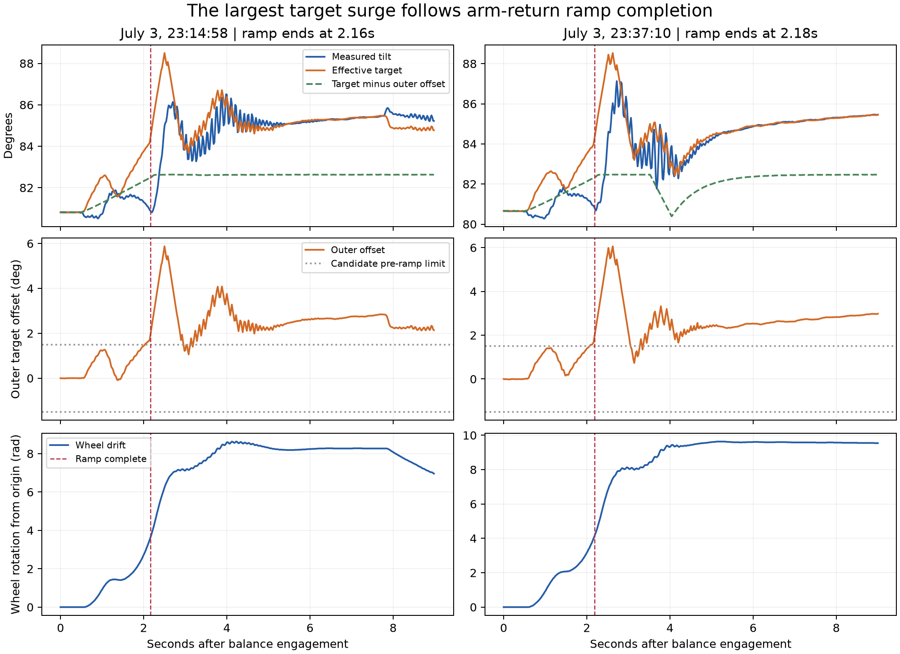

# Balance firmware review — September 13, 2026

**Final firmware flashed and verified; the first physical balance attempt is pending.** The device-check addendum records backup, upload and disarmed checks. This candidate strengthens sensor handling, verifies arm arrival, bounds wheel commands, and makes the next run's data substantially more trustworthy. It preserves the established Speed-mode controller and avoids aggressive gain changes. Offline simulation does **not** establish improved stand-up reliability.

Source baseline: `e8b1280`, originally on `agent/balance-telemetry-sync`. Candidate branch: `codex/balance-review-ready`. The exact committed source, build versions, binary hashes, and rollback files are identified in `artifacts/balance-candidate/manifest.json`. [Current state](progress/CURRENT.md) and [test procedure](BALANCE_TESTING.md) are the handoff for the next session.

## Evidence reviewed

- All **112 unique telemetry CSVs**, totaling **193,071 rows**. Of these, 32 explicitly identify Speed mode; 30 have enough useful Speed-mode data for the model fit. [File inventory with SHA-256](../evidence/balance-review/historical-inventory.csv), [analysis](../evidence/balance-review/historical-analysis.txt).
- Existing firmware, build configuration, project documentation, and tuning history. Historical document instructions were treated as context, not as new authorization to operate the robot.
- All **five photos** and sampled frames throughout **seven videos** supplied in `Desktop/Hopscotch Media`. The video review used contact sheets at approximately three-second intervals; it was not a frame-by-frame motion reconstruction. [Media inventory](../evidence/balance-review/media-inventory.json) records filenames, hashes, durations, and original video timestamps. Originals were preserved; no exact log/video synchronization was possible.
- Austin confirms the same hardware and arm calibration as July. The sensor mounting can move enough to change the apparent balance point by several degrees.

The target remains the AtomS3R with its BMI270 IMU, four RS05 drive motors and two RS00 arm motors. The retained PlatformIO 6.7.0 / ESP32-S3 / octal-PSRAM configuration agrees with the [manufacturer's AtomS3R documentation](https://docs.m5stack.com/en/core/AtomS3R). No wheel radius, mass, inertia, or center-of-mass dimensions were inferred from photographs.

## Findings and corrections

### 1. The latest large surge occurs after the arm-return ramp

The final two July logs are the most useful comparison because their balance samples are nearly continuous: maximum gaps of 25 and 27 ms. Each contains 51.161 seconds of recorded balancing, preceded by tip-up. Both stop at the old 3,000-row capacity without a terminal reason; neither proves a fall at that time.

| Measured quantity | July 3, 23:14:58 | July 3, 23:37:10 |
|---|---:|---:|
| Ramp complete after engagement | 2.162 s | 2.181 s |
| Wheel drift at ramp completion | 3.62 rad | 4.11 rad |
| Largest target-minus-tilt error within the following 1.5 s | 4.68° | 5.07° |
| Time of that error after engagement | 2.320 s | 2.340 s |
| Outer setpoint offset at that instant | 3.84° | 3.83° |
| Peak absolute drift over the captured balance period | 12.01 rad | 9.63 rad |
| Samples within 2° of commanded tilt | 86.6% | 95.3% |



The earlier explanation attributed the worst target error to the ramp-phase velocity damper. The flags show the largest error **after** `ramp_complete` becomes true. This matters because the prepared 1.5° ramp offset limit releases at that transition. It can constrain the earlier ramp but cannot, by itself, prevent the principal post-ramp surge. Values above use the same-row `setpoint - roll`; the separate inner-loop `angle_err` field is sampled at another instant and differs slightly.

The outer correction both brakes motion and compensates for remaining equilibrium error. In the last run, roughly 2–3° of correction remains during later calm balance. Permanently clamping it to 1.5° would also remove needed equilibrium authority. This is why a simple harder clamp was not adopted as a claimed cure.

A simulation-only gradual release of the outer controller was evaluated and rejected: longer transitions reduced some drift but increased early failures. The firmware retains the existing transition. The first physical run must measure this interval directly.

### 2. Good angle tracking does not imply good balance performance

The CSP-era `bal_20260412_194229.csv` records 35.799 seconds of balancing and 88.7% of samples within 2° of target while drifting **60.39 wheel radians**. A moving or biased target can be followed accurately while the robot rolls away. Track displacement, speed, arm behavior, recovery time, and human intervention alongside angle error. Wheel radians are not meters and do not account for tire slip.

A separate historical claim for `bal_20260409_220324.csv` describes approximately 30 seconds / 98% stability. The supplied file contains only 580 total rows, 146 balance rows, 2.904 seconds of balancing, and 50% within 2°. The raw file takes precedence; the conflicting narrative is retained as history, not reused as validation.

Seventeen old files have a likely capacity cutoff and no terminal reason. Their durations are observation windows, not established survival/fall times. Some old profiler reports also contain long idle-state stalls caused by serial downloads. These must not be counted as upright control freezes. Actual earlier balance-task/control-task stalls remain real evidence in their respective runs.

### 3. Sensor freshness had a real architectural weakness

Previously, the slower control task read the IMU and the 200 Hz task repeatedly consumed its last published values. A control-task stall could therefore freeze sensor input while the fast task continued integrating stale gyro values. The existing heartbeat dead-man alone did not distinguish that from a fresh sensor stream.

The fast task now owns IMU acquisition. It accepts only finite samples whose driver reports both accelerometer and gyro data, timestamps successful reads, integrates each sample once, and adjusts filter coefficients for the actual sample interval. A stale/invalid stream or a missed sample deadline over 50 ms latches a stop during tip-up/balance. The outer task independently checks age in case the fast task blocks inside a read. A new attempt requires 200 ms of healthy sensor data. The hard control-heartbeat stop also latches instead of resuming automatically when the heartbeat returns.

These are code-level protections, not measured sensor performance. The first disarmed connection must verify steady sample delivery and sensible tilt/rate. Host tests do not emulate the BMI270 bus or FreeRTOS scheduling.

### 4. Sensor movement requires cautious learning

The existing settled-capture re-zeroing remains: the arm-angle curve supplies its shape, while each settled capture estimates the absolute level for that attempt. There is no new requirement to erase the existing arm calibration.

Persistent trim now uses a recently qualified calm estimate instead of the final integrator value after a shove or fall. Qualification requires one continuous second with low body rate, wheel speed, tracking error and command, neutral arms in READY, and no diagnostic flags. Saving still requires at least eight seconds after ramp completion; an estimate older than ten seconds is rejected. A valid estimate is blended by 50%, with small changes omitted, and written only after disarm.

This helps tolerate offsets between attempts. A loose sensor rotating independently of the chassis during a run is not identifiable reliably from that IMU alone. Firmware cannot promise to correct arbitrary mounting movement. Keep the mounting consistent during the first comparison and record any observed movement.

### 5. What the videos establish

| Video | Original local capture date/time | Duration |
|---|---|---:|
| IMG_2718 | April 10, 22:40:37 | 7.4 s |
| IMG_2721 | April 12, 16:47:02 | 17.3 s |
| IMG_2722 | April 12, 17:45:15 | 23.9 s |
| IMG_4097 | July 2, 17:49:51 | 17.3 s |
| IMG_4098 | July 3, 09:49:27 | 14.2 s |
| IMG_4099 | July 3, 09:57:37 | 24.4 s |
| IMG_4100 | July 3, 10:05:44 | 34.6 s |

All dates are 2026 and use the original QuickTime creation timestamp, not the September export timestamp. April samples show quiet balancing on a tabletop. July samples show pushes, arm excursions/reversals, and substantial translation, including motion out of view. All clips begin with the robot already upright and show a USB cable attached. They do not validate the complete self-righting sequence, untethered performance, or the final July evening changes. Photos help identify the mechanism and wiring layout but do not establish a measured cause for a particular fall.

## Firmware changes

| Area | Change and purpose |
|---|---|
| IMU/filter | Direct 200 Hz acquisition, successful-read age, finite-data checks, single integration per sample, latched stale fault; display filter corrected to its configured 50 Hz cadence. |
| Start conditions | Require calibration, both motor groups armed, all six motors online/enabled without reported faults, recent feedback, healthy IMU, and reasonable finite gains. |
| Arm transitions | Tip completion and final return completion require measured positions within 0.15 rad of both goals. Add 15-second tip-up and 8-second return timeouts. Generated targets alone no longer prove arrival. |
| Wheel authority | Limit yaw correction to the remaining speed margin so neither rear wheel exceeds the common limit (30 rad/s normally, 20 during degraded heartbeat operation). Preserve the average balance command. |
| Motor setup | Abort Speed-mode setup if acceleration-limit readback fails, as already done for the current limit; request motor stop on either failure. This does not add readback verification for every CAN command. |
| Trim | Save a recent calm-qualified estimate after disarm, rather than the final disturbed integrator. |
| Serial/web | Bound serial input per control tick, discard overlong commands, and reject active-run tuning/bench commands. Serial/web disarm ends balance and requires both RC arm switches low before rearming. Web disarm is serviced on the control task; maintenance requests require disarmed idle state. |
| Telemetry | Retain schema v2 and its 6,000 × 220-byte PSRAM buffer; use the reserved sample byte for maximum IMU age within each 50 Hz window. Add latched-IMU and failed rear-wheel CAN transmission diagnostic bits; preserve brief inner diagnostics across the whole window. |
| Storage/USB | Require drive **and** arms disarmed before log save, clear or download. Retry partial USB writes with a bounded no-progress timeout, suppress periodic debug during downloads, and validate a checksum over the exact transmitted CSV bytes. Preserve successful and failed raw transfers on the computer. |
| Analysis | Correct parsing of headers preceded by debug output, calculate actual historical sample gaps, distinguish likely capacity cutoffs, report new sensor/CAN diagnostics, and read current firmware constants in the approximate simulator. |

Compared with baseline `e8b1280`, the only default gain change is restoring position-return gain **0.08 → 0.05**, the last physically tested value. The prepared 1.5° ramp limit is retained but remains untested on this robot. Inner PD stays **2.0 / 0.08**, velocity PI stays **0.7 / 2.2** around its **0.8 rad/s** knee with **Ki 0.35**, and the post-ramp offset limit stays **8°**. The arm schedule, assist lifecycle, motor directions/IDs, calibration, and partition layout are retained.

The 120-second recorder and most rich v2 fields were already prepared in `e8b1280`; this review hardens them. They were not present in the July raw runs and have not yet been verified on the robot.

## Offline validation and its limits

[Consolidated validation output](../evidence/balance-review/validation.txt) records a successful AtomS3R firmware build, native C++ checks, twelve Python tests, Python/shell syntax checks, and whitespace checks. Native checks cover 100,000 randomized wheel mixes, sensor validity/time rollover, and the actual USB transport class with partial writes, no progress, and disconnects. Python checks cover a full 6,000-row synthetic transfer, silent numeric corruption, truncation, malformed/nonfinite rows, backwards time, mixed newline styles, interleaved debug, and legacy/v2 compatibility.

The Speed-mode plant fit gives approximately A=8.019, B=5.862 and a 60 ms motor lag. It is a fitted planar approximation, not a mechanical digital twin. Its gain suggestions were not adopted automatically.

| Simulation result | July-33 approximation | Candidate |
|---|---:|---:|
| Capture/arm-return cases | 72 | 72 |
| Early failures | 2 | 3 |
| Later failures | 11 | 11 |
| Median absolute drift at ramp completion among early survivors | 2.320 rad | 2.248 rad |
| Separate signed-push cases | 18 | 18 |
| Failures in those push cases | 0 | 0 |

Early failure means before ramp completion or within three seconds afterward. The 16-second cases vary plant coefficient, arm equilibrium shift, capture offset and noise seed. They begin near upright engagement; they **do not simulate lifting from the floor**. Push cases apply model velocity impulses at 15 seconds in a 30-second simulation. [Full cases and results](../evidence/balance-review/simulation-candidate.json).

The candidate shows small displacement reductions but slightly more early failures in this approximation. This is **not evidence of improved stand-up success**. The prepared 0.08 return gain regressed recovery and was dropped. Simulation-only handoff blends of 1–3 seconds produced 5–8 early failures versus 3 without blending, and introduced push failures; none was ported to firmware. [Rejected handoff results](../evidence/balance-review/handoff-comparison.json).

Simulation omits floor/arm contact, tire slip, cable forces, mounting motion, full CAN scheduling, actual arm dynamics, and battery/current limits. No physical closed-loop, sensor-failure, motor-failure, power-loss, or full v2 LittleFS/USB throughput test has been performed. The later device check verified startup and legacy USB download. A stop command cannot guarantee a stop if motor communication has failed. Existing same-core task sharing and asynchronous maintenance paths are not a formally verified concurrent system.

## Next connection and acceptance evidence

1. Attach USB with drive and arm switches low, robot resting securely. Before flashing, retain the existing device log, `cal status`, `bal status`, and settings. Preserve the existing calibration; do not run factory reset or `uploadfs`.
2. Flash firmware only using the prepared project. The package contains a rebuilt `e8b1280` rollback image, **not a backup of the unknown bytes currently on the robot**. The next session should take a device backup where the connected interface permits it.
3. While disarmed, confirm PSRAM allocation, fresh IMU values, sensible roll/rate, retained calibration and all motor IDs. Verify low/high/low disarm behavior supported on the floor before attempting balance. Do not deliberately inject failures while upright.
4. Start with one normal tip-up and a 30-second untouched balance attempt. Film the whole sequence from the side, including the floor path. Tag the run and note surface, battery, cable contact and any intervention. End and download even if it fails early.
5. Assess the transition at ramp completion, then progress to light marked pushes and a 60-second station test only if the previous run is controlled. End each initial run before the 120-second capture limit, and download after every run.

For each comparison record: success/intervention, tip and arm-arrival times, peak tilt error, wheel speed and drift, visible floor displacement, return time, sensor age, missed ticks, saturation/diagnostics, arm lifecycle, power and CAN feedback ages. A promising result is repeated stand-up without help, materially less post-ramp travel than July, steady station keeping, and complete validated logs. Numeric thresholds for physical floor travel need a wheel-radius measurement and an agreed test-area bound; these were not invented from the photographs.

## Reproduction

From the project root, using the existing Python environment:

```bash
./scripts/check_balance_candidate.sh
.venv/bin/python scripts/review_balance_history.py
.venv/bin/python scripts/fit_balance_model.py --speed-only --json evidence/balance-review/model-fit-speed.json
.venv/bin/python scripts/evaluate_balance_candidate.py
.venv/bin/python scripts/compare_balance_handoff.py
.venv/bin/python scripts/plot_balance_handoff.py
```

The package manifest identifies the prebuilt artifacts; rebuilding later may select newer libraries under the existing version ranges. The initial preparation performed no upload. Austin then attached the robot and authorized flashing; the device-check addendum records that continuation. No calibration reset or Git push was performed.


## Device-check addendum — September 13, 2026

Austin attached the robot and explicitly authorized flashing. Before upload, both motor groups reported disarmed and all six motors were online with no reported faults. A complete 8,388,608-byte flash readback was saved under `artifacts/device-backup-2026-09-13/`. SHA-256: `656315c60093be1869d023ae8d8f9073e82c02cad14fcfe17582ef3938edece8`. Its partition table exactly matches the candidate. The settings JSON and original log were extracted successfully using littlefs-python 0.15.0; the older installed mklittlefs extractor was incompatible with this filesystem. The full original readback remained unchanged. Backups contain device settings and remain local/ignored.

The recovered, undated log adds **673 rows** beyond the original 112-file review. All are tip-up state, spanning 26.170 seconds, with a maximum sample gap of 1.033 seconds and tilt staying approximately -5°. There is no balance engagement, configuration header, or terminal reason. Its exact firmware/date and reason for ending are unknown; it is not evidence of the new candidate's behavior. [Recovered data](../evidence/balance-review/device/recovered-undated-log.csv) and [analysis](../evidence/balance-review/device/recovered-log-analysis.txt).

The first application-only upload verified successfully. Startup confirmed the 1,320,000-byte PSRAM buffer, retained arm calibration (center deltas 1.768/-1.767 rad; backward 3.661/-3.670), retained 0.97° trim, the intended 0.05 return gain, and a continuously healthy IMU stream. Motors initially had no battery power; Austin connected the battery, after which all six responded and CAN transmit-error count returned to zero. No motor arming or balance attempt was commanded. The existing 673-row log downloaded successfully through the new firmware; this exercises legacy export, not the new full-size v2 recorder.

A live serial check and inspection of the installed Arduino 2.0.16 HWCDC implementation exposed a zero-timeout retry-counter underflow path. The final candidate sets the live timeout to **1 ms** instead of zero, avoiding the unsigned decrement-underflow path. This is a short bounded no-progress wait, not a claim that every serial call is wait-free. Explicit idle downloads retain their separate retry/checksum handling. Active-run `bal status` now reports buffered counts without opening/statting LittleFS. These follow-up changes were rebuilt and included in the final flashed artifact identified by the package manifest. Final verification is recorded in the device evidence and current-state document.


Final result: application SHA-256 `853267ab800a95f81ceb2c721df65f761ad1cd35018c592611f24232e4e71262`, built from firmware source in commit `51c8d49`, programmed and verified at `0x10000`. Flash uses 1,134,229 bytes of the application budget; static RAM is 50,448 bytes, with the recorder separately allocated in PSRAM. [Final upload evidence](../evidence/balance-review/device/final-flash.txt) and [disarmed checks](../evidence/balance-review/device/final-checks.json).

All six motors are online, both groups remain disarmed, current CAN transmit/receive error counters are zero, calibration and 0.97° trim are retained, and three returned IMU status samples were 2.091–8.421 ms old with no latched fault. The final firmware's legacy USB export matched all 673 original rows exactly. No motors were armed by the agent and no stand-up attempt was initiated. Full v2 capture/write/export still requires the first physical run. Follow-up source changes since the flashed source commit are documentation/evidence only.
