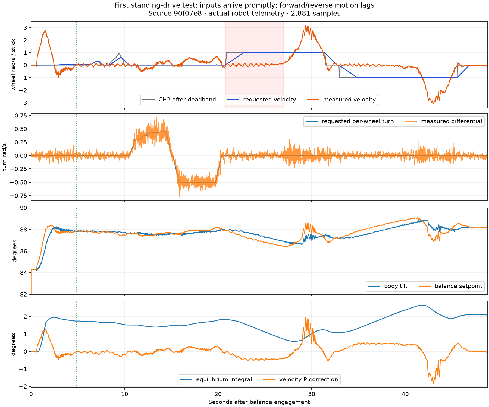

# Driving while balanced — September 19, 2026

> **Historical record:** this document describes the dated release or trial below. For the installed firmware, see [current state](progress/CURRENT.md). Use [OTA updates and Wi-Fi telemetry](WIFI_OTA.md) and the [current test guide](BALANCE_TESTING.md) for new work. Older package paths, app0-only USB commands and “next” actions below are preserved as history; they are not instructions for updating the current robot.

Austin requested CH1 left/right and CH2 forward/back control after standing, and explicitly authorized deployment. The starting point is the successful recoil-release application `1d80257` / SHA-256 `5d3465e0269f9df19065d1583de35d093b46f947fdd27e49ef0de0bbf28d4dd0`, archived in `artifacts/balance-recoil-release/`. All earlier physical logs are retained.

## Operator behavior

Stand up using the existing sequence: arms in their usual forward starting position, CH1/CH2/CH4 neutral, CH7/CH9/CH10 HIGH, wait two seconds, then CH11 HIGH for one second and LOW once. Keep CH7 HIGH throughout standing operation.

After startup recovery and arm return finish, keep both driving sticks centered and let the robot become calm. A continuous 400 ms centered/calm interval unlocks driving. The console reports `Standing drive READY`. A stick held through startup cannot launch it when it stands up; center both sticks to unlock.

- **CH2:** forward/back velocity request; positive follows the existing ground-drive forward sign.
- **CH1:** left/right steering; positive makes the left wheel faster and right wheel slower, matching the existing ground-drive mixer.
- **Center both:** requests a gradual stop, then holds the new position and heading. It does not request a trip back to the stand-up origin.
- **CH7 HIGH before tip-up:** ground-drive commands are suppressed, including a held stick while arming. CH7 LOW retains ordinary ground driving.
- **Input interruption or large balance error:** motion requests taper to zero, and fresh centered/calm input is required before driving resumes. Existing disarm and link-loss abort behavior remains.

The initial release deliberately limits average requested wheel speed to **±1.0 rad/s** (about 9.5 wheel RPM) and turn differential to **±0.5 rad/s per wheel**. Forward acceleration is 0.5 rad/s², braking/reversal 0.75 rad/s², steering slew 0.75 rad/s². These are independent of the ground-mode speed knob. A full-scale velocity request takes two seconds to ramp up. No unverified tire radius is used to promise a floor speed.

First test: stand and settle with centered sticks, then apply a small forward input for about one second and center until stopped. Repeat backward, then brief small left/right inputs. Test combined driving/turning after those work. Keep the cable clear, support/disarm if movement is uncontrolled, and finish well before the 120-second recording limit. Support and lower **both CH9 and CH10**, leaving battery/USB connected for a full download. Do not intentionally test radio failure upright.

## Control changes and reasons

Previously, `main.cpp` sent no stick inputs to the balance controller; the ground-drive controller was bypassed while balancing. The position loop also continuously pulled toward its saved holding point, and yaw synchronization opposed all turns. Simply applying tank-drive motor commands would conflict with balance.

The new hardware-independent `BalancePilot` helper handles deadband, centered/calm unlock, velocity/turn limits, slew, stale-input stopping and stop confirmation. CH1/CH2 are read explicitly from CRSF channels 0/1, without the serial simulation override. Pilot freshness is at most 100 ms; wheel feedback at most 30 ms. Both motor groups must be armed, startup recovery inactive and the measured arm/base ramp complete. New requests pause at 5° tracking error or 30°/s body rate. Invalid inputs/timing cannot create an accelerating step.

Forward/back modifies the existing velocity-error loop, and the shaped velocity is also fed forward inside the 200 Hz common-speed calculation. This separates cruising speed from the equilibrium angle correction. The same integral remains continuous; it is neither reset nor duplicated. The normal integral gain remains active while driving; the 4× calm-glide boost is suspended through driving/braking because screening found it worsened motion transients. Normal stationary behavior resumes after stopping.

While driving/braking, position hold follows the measured location and requests the shaped velocity rather than returning to the previous hold point. After zero command and 400 ms calm (average speed <0.30 rad/s, differential speed <0.20 rad/s, body rate <4°/s, error <1°), the new hold position is retained. Raw logged odometry always stays relative to engagement.

Turning uses the existing differential mixer, with sign matching ground drive. The heading reference follows the wheels during a turn and captures the new heading when steering reaches zero. Straight driving retains heading correction. The common balance command keeps first claim on wheel authority; yaw is clipped to remaining headroom on both wheels. Existing 30 rad/s wheel caps, motor limits, arm assistance, disarm/IMU/feedback/deadman protections remain.

Persistent trim qualification is disabled and any pending qualification invalidated while driving/braking. It must qualify again at rest before saving; intentional cruising cannot be stored as a new balance-angle calibration. Settings and mechanical calibration formats are unchanged.

## Telemetry and compatibility

Schema 3 appends 16 bytes to the exact 220-byte schema-2 prefix, giving **236 bytes/sample**, feature flags **127**. New fields are deadbanded `pilot_forward`, `pilot_steering`, shaped `pilot_turn`, and `pilot_flags`: ready=1, moving/braking=2, turning=4, fresh RC input=8. Pilot fields describe the balancing phase; TIP_UP initializes them to zero. `target_vel` records the shaped forward command during movement and the ordinary position-hold request otherwise. Inner raw/limited commands include velocity feedforward.

Old schema-2 samples are read at their original 220-byte size, checksum-verified against that size and exported with unknown/empty pilot fields. Their original metadata remains intact. The host validator accepts those unknown fields only for older records, and requires values in new schema-3 logs. Legacy CSV export remains available.

The 6,000-sample, 120-second capacity is retained. PSRAM sample storage is 1,416,000 bytes; the unchanged LittleFS partition is 1,572,864 bytes. Layout assertions and a 6,000-row transfer test cover the new size/export; a full-duration physical filesystem write is not yet exercised. No filesystem upload or partition change is needed.

## Verification and findings

All **six native suites and 23 Python tests** pass, along with syntax/whitespace and the pinned ESP32-S3 firmware build. Production pilot tests cover held-stick startup inhibition, neutral/calm confirmation, both directions, steering signs and balance-first clipping, input loss with held-stick return, stop/heading handoff, nonfinite/stale timing, 50,000 bounded updates and old/new sample layouts. The existing safety/parser/motor/transport suites remain green.

The planar model invokes the actual C++ pilot through `pilot_bridge.cpp`; the surrounding balance loop is the existing mirrored simulator. With neutral sticks, all **324 complete trajectories match the installed recoil-release model exactly**, including its failures; standing/settling control is preserved in that check.

Movement screens have 54 parameter cases per profile. At the selected gentle limits, forward–stop–reverse–stop and input interruption each produce 9 model failures versus 11 while holding, with **zero newly failing cases**. Only 36/31 cases respectively actually issue motion commands: some model cases never become calm enough to unlock. These counts must not be described as 54 successful driving tests. The model's stationary motion is substantially noisier than the real successful traces, and no commanded survivor met the arbitrary final RMS <0.3 rad/s metric. It is a regression screen, not proof of precise speed tracking or braking distance. It has no yaw, tire-slip, contact or power model; physical turning and combined movement remain untested.

Rejected, never-flashed screens are retained under `evidence/balance-standing-drive/`: at a 2 rad/s limit, no feedforward introduced 10 new forward/reverse failures; adding feedforward reduced that to 3; enabling the 4× glide boost during movement increased it to 16. The final lower 1 rad/s speed / 0.5 rad/s² acceleration and feedforward policy introduced none in the screened cases. Input-loss comparisons likewise improved from 5/0/10 new failures in those variants to zero. These are approximate-model findings, not physical reliability rates.

Application file: **1,141,584 bytes**, SHA-256 `83d50ac277799094e58395cab3a9296e66c27718226da847a0442eea5a4c7c7d`. Build flash usage 1,141,221 bytes, static RAM 50,800 bytes. Source/package/actual upload checks are recorded in `evidence/balance-standing-drive/` and `artifacts/balance-standing-drive/`. The first physical drive test completed; results and response follow-up are below.

## Release and restoration

Freshly verify both groups disarmed/no pending unsaved data; upload application only at `0x10000`, then verify six motors online, retained calibration/trim and healthy IMU/CAN. Preserve the prior saved log for an actual schema-2 download compatibility check before the new test.

Restore the immediately preceding successful recoil-release image, after confirming disarm, with:

```sh
.venv/bin/python scripts/flash_prepared_balance.py --package artifacts/balance-recoil-release --flash
```

Do not add `--rollback`: that flag refers to a much older rebuilt original baseline. Download any new schema-3 log before restoring older firmware, which cannot decode the new sample layout. The original full-device backup and earlier packages remain available locally.

## First physical test and response follow-up

Source `90f07e83e3472cebbc5ca2646e585bfbce20f2d7` / app `83d50ac277799094e58395cab3a9296e66c27718226da847a0442eea5a4c7c7d` was flashed and verified at 0x10000 after a fresh disarmed preflight. By the postflash status check Austin had armed both groups; the disarm-only helper correctly rejected that state, while raw output confirmed IDLE, six healthy motors, preserved calibration/3.57° trim, and healthy IMU/CAN. No tool arming or motion commands occurred. The prior v2 log was already archived; a physical v2 compatibility download did not occur before the new run replaced it.

Austin reported that all directions worked, turning was slow/responsive, and forward/back was very slow with a long delay. Retrieved all **2,881 samples / 57.601 seconds**, including 48.780 seconds BALANCE, in `bal_20260919_155240_standing-drive-first-test.csv`. Schema 3/features 127, binary checksum `0x90FA4B79`, USB `0xED14696F`; end arms disarmed. Posttrial both groups disarmed, pending save clear, six motors healthy, calibration retained, trim learner 3.89°.

Driving unlocked at 4.880 seconds after engagement and did not drop out during the driving portion. Full forward input took **6.420 seconds** to exceed +0.25 rad/s; reverse took **6.840 seconds** to exceed −0.25 rad/s, despite target reaching 90% in about 1.8 seconds. Filtered speed then overshot to +3.169/−3.097 rad/s against a ±1 target. Short initial throttle inputs produced almost no travel. Turn differential followed the requested sign for every sample with >0.2 rad/s turn command; RMS differential error 0.090 rad/s. Final two-second average-speed RMS was 0.036 rad/s.

This is a controller response problem: near rest, the old low-error P term is −0.462° per +1 rad/s request. With inner Kp=2, its −0.924 rad/s contribution nearly cancels +1 rad/s cruising feedforward. The slow integral must change before substantial lean/motion develops. This arithmetic explains the cancellation, while the delayed surge is measured evidence; neither guarantees a proposed replacement's physical response.

No saturation, IMU fault or CAN TX-failure rows. Maximum tracking error 1.511°, BALANCE inner interval 5.032 ms, sample interval 21 ms, rear feedback age <=2 ms after the first 50 ms. Logged IMU maximum 20 ms remained below the fault threshold. Minimum bus 24.18 V; arm-assist maximum fraction 0.0049. Existing zero-stall profile retained. Raw observer includes stop retries after operator disarm; contact/handling timing was not marked. Intentional travel is not classified as runaway.



Reproducible metrics/figure: `evidence/balance-standing-drive/analyze_trial.py`. Austin authorized a faster response follow-up; see [response v2](BALANCE_DRIVE_RESPONSE_2026-09.md). The exact first-drive package remains available as `artifacts/balance-standing-drive/` for restoration.
