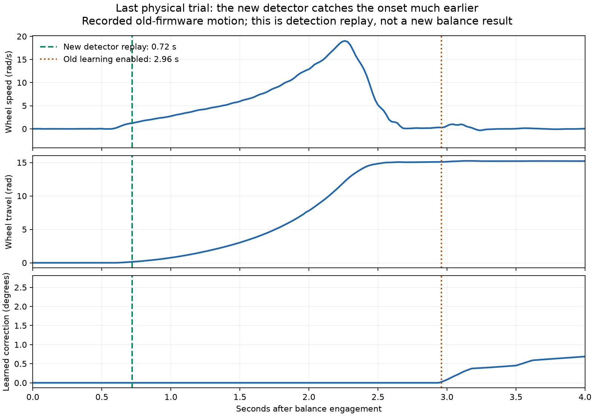
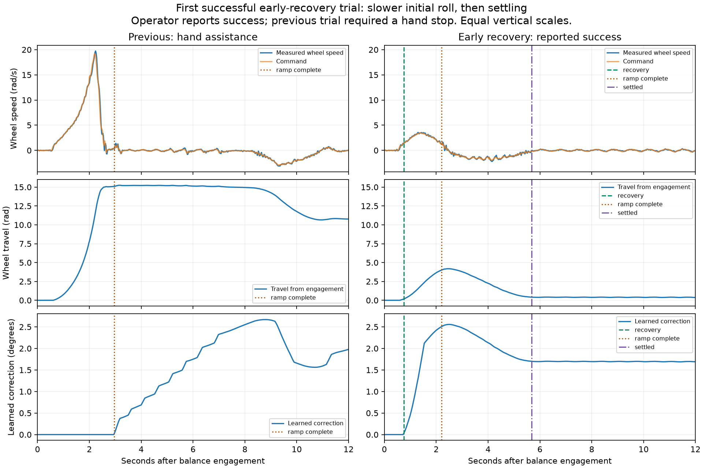

# September 14: respond to early roll-away, then learn equilibrium

The latest stand-up still required a hand stop. Austin's requested direction is to detect the developing runaway and respond promptly, giving the controller time to find equilibrium instead of guessing a fixed balance angle. This firmware implements that approach. The first follow-up succeeded according to Austin, and the complete telemetry records an early catch followed by settling. This is one successful trial; repeatability remains to be measured.

## What the last trial established

The capture correction (`a8aa9a1`) ran normally but did not solve roll-away. All 1,119 samples over 22.363 seconds were recovered from [the trial](../telemetry_logs/bal_20260914_223915_capture-trim-assisted.csv), with valid binary `0x3F3F58BA` and transport `0x28979A65` checksums. It ended with `drive disarmed`. Austin reports intervention followed by excellent balance; contact timing is unmarked. The USB observer captured the actual run with no reboot. The earlier reboot was attributed by Austin to a cable bump.

Balance engaged at 8.825 seconds; arm return began 0.421 seconds later, and the ramp completed 2.961 seconds after engagement. In the first four balance seconds the average wheel speed peaked at 19.735 rad/s, command at 19.211 rad/s, and wheel displacement at 15.244 rad. Displacement is wheel rotation, not measured floor distance. Later calm forward-arm tilt was 88.644°, versus 84.459° at engagement. That supported capture is not a reliable free-balance angle.

The run receiver maximum was 516 µs, with zero recorded stalls. CAN receive misses and TX failures stayed zero throughout the observed boot/trial. Maximum recorded inner interval was 5.009 ms, IMU age 20 ms, and wheel feedback age after the first 50 ms of BALANCE at most 2 ms. Both groups were disarmed afterward, all six motors online, calibration retained, learned trim 2.44°. The new problem is not explained by a recurrence of the previously corrected receiver stall or CAN overflow.

The controller withheld integral equilibrium learning until the entire arm/base ramp finished, and then reset that integral to zero. Normal/emergency arm assistance was also unavailable until that handoff. The runaway starts substantially earlier.

## Firmware changes

1. **Detect the onset during arm return.** Both rear-wheel motion samples must be at most 30 ms old and measured tip fraction at most 0.90. Filtered average speed must exceed 1.0 rad/s with outward acceleration at least 2.0 rad/s², or exceed 4.0 rad/s regardless of acceleration. Acceleration filtering uses 60 ms; direction must qualify consistently for 60 ms. Detection is symmetric and one-shot per attempt.
2. **Start learning immediately from wheel motion.** Use the existing single velocity integral, with Ki 1.0 (ordinary Ki is 0.231), for at most 800 ms or until ramp completion, whichever comes first. Integral change is limited to 6°/s and ±6°. During recovery the combined offset may reach ±6° instead of the ordinary early-ramp ±1.5°. The existing 12°/s offset slew, overall target limits, inner PD, motor limits and safety exits remain. Saturation blocks further outward integration but permits unwinding; stale/invalid inputs hold the learned value.
3. **Aim to stop first.** While recovery is active the wheel-velocity target is zero. The position loop does not demand a simultaneous trip back through accumulated stand-up travel. The base retains its normal 4°/s limit without the velocity-dependent slowdown after detection, so it does not lag farther behind the changing arm equilibrium.
4. **Keep the correction through handoff.** Do not erase an active run's learned integral when the arms/base finish. The temporary boost ends, normal high-slope velocity P becomes available at ramp completion, and the same integral continues with ordinary Ki. This avoids a separate competing estimator.
5. **Hold where it settles.** After ramp completion, require 400 ms of fresh feedback with wheel speed below 0.7 rad/s, body rate below 4°/s and target error below 1°. Then capture the current location as the position-hold reference and return to normal balance control. Logged displacement remains relative to the original engagement point; the hold change cannot hide travel.
6. **Record the intervention precisely.** Feature bit 16 identifies `wheel_velocity_learning_v1`. State flag `0x80` latches detection; diagnostic bits `0x1000/0x2000/0x4000/0x8000` identify recovery, boost, limiting/input hold and settling. Existing velocity, integral, offset, tilt and arm channels explain how the response evolved. The binary schema remains v2, 220 bytes per sample.

Inner gains remain 2.0/0.08. The 1.9° arm schedule, 1.5 rad/s arm return, arm poses/calibration and normal post-settle balance gains remain. No new fixed equilibrium angle or fast early arm throw is deployed.

## Verification and limits

The production detector replay fires at 0.760 seconds in the preceding feedback-correction trial (1.364 rad/s, 0.216 rad travel) and 0.720 seconds in the latest trial (1.222 rad/s, 0.142 rad travel). Replay establishes detection timing only; it does not show how the physical robot will respond to a different command.

Five native suites and 19 Python tests pass, including signed/spike rejection, one-shot/rollover/calm lifecycle, stale-input hold, anti-windup, 50,000 bounded integral updates, unchanged behavior before detection, preserved integral at ramp handoff, and position-hold capture without rewriting travel. Existing USB/receiver/motor regressions pass. Syntax and whitespace checks pass. ESP32-S3 build passes: 1,138,013 flash bytes, 50,752 static RAM bytes, unchanged 1,320,000-byte PSRAM log allocation.

The final source-mirrored model's 324 stress cases show:

| Outcome | Installed capture correction | Early wheel recovery |
|---|---:|---:|
| Early failures | 145 | 86 |
| Later failures | 49 | 60 |
| No completed ramp | 103 | 26 |
| Median peak stand-up wheel travel | 18.606 rad | 7.963 rad |

The candidate rescues 67 failing cases but introduces 19 failures among previously passing cases. These are deliberately varied model conditions, not physical success probabilities. The approximate planar plant omits ground/arm contact, arm reaction dynamics, tire slip, mounting play and hand intervention. It supports trying an earlier bounded response, not claiming reliability. A short physical test must check both the initial stop and subsequent settling.

Rejected alternatives remain evidence only: a fixed 3.5° curve, faster arm returns, early arm assistance, and longer/stronger wheel-learning boosts. Early arm assistance increased modeled early and late failures. None of those experimental builds was flashed. See [evidence index](../evidence/balance-startup-recovery/README.md).

## Release and next test

Frozen package: `artifacts/balance-startup-recovery/`; exact source and image hashes are in its manifest. Previous installed image is `artifacts/balance-capture-fix/` (`068d043b64f957f577bae658446638e56c3c2b60ea523946bff4614a8d76a4c3`). The full original device backup is retained. Application-only programming at `0x10000` preserves settings and saved logs. The package's `--rollback` option selects the rebuilt original baseline, so use the **previous package without `--rollback`** to restore the immediate prior release.

After fresh disarm verification, flash and verify the application, then read motor, IMU and calibration status while disarmed. For one operator-triggered trial: usual forward-arm starting pose, CH1/2/4 neutral, CH7/9/10 HIGH, wait two seconds, CH11 HIGH for one second then LOW once. Support and disarm promptly if it runs away; if it settles, leave it untouched for five seconds. No tap on this trial. Lower CH9 and CH10 and retain battery/USB for the checksummed download. Firmware starts recording automatically at tip-up; the host observer adds run/event context.

## Flash and stationary verification

Flashed and verified source `720f2e31939a249a215b2b7f7c197130f2301310`, application SHA-256 `5531c6287dd5ef8d398d426a7596d8c6d91e6c914825d137bc9a1ef485734e35`, application only at `0x10000`. Fresh preflight and postflash both groups disarmed; all six motors online with no errors. IMU age 5.974 ms, tilt −1.9°, no latched fault; receiver maximum 516 µs and CAN receive misses/TX failures zero. Calibration remains valid with center deltas 1.768/−1.767 and back deltas 3.661/−3.670 rad; stored trim remains 2.44°. Forward references became 0/0 with ordinary boot encoder zeroing, while raw arm positions match the preflash pose. No calibration reset or tool-initiated movement.

The observer is recording with note `early-wheel-recovery-v1`. One short normal operator-triggered attempt has been requested; physical benefit is pending.

## First successful physical trial — September 14, 23:31 download

Austin replied **“That worked perfectly!!”** to the requested unaided short stand-up. Preserve this as the first operator-reported successful start on the early wheel-recovery firmware. It does not justify changing gains after a single result. The installed source remains `720f2e31939a249a215b2b7f7c197130f2301310`, application SHA-256 `5531c6287dd5ef8d398d426a7596d8c6d91e6c914825d137bc9a1ef485734e35`.

[All 1,203 samples](../telemetry_logs/bal_20260914_233101_early-recovery-first-success.csv) were retrieved and validated: 24.173 seconds, including 15.350 seconds of BALANCE; end `drive disarmed`, file checksum `0x29CB8EA4`, USB checksum `0xA2EED9A2`. The log identifies feature flags 31 and `early-wheel-recovery-v1`. The passive host observer expired before the operator started; this result comes from the complete onboard capture and Austin's report, not a continuous host observation or video. The saved profiler has `balance_run` scope.

| Recorded measurement | Previous assisted trial | First successful trial |
|---|---:|---:|
| Engagement tilt | 84.459° | 84.447° |
| Peak average wheel speed, first 4 s | 19.735 rad/s | 3.561 rad/s |
| Peak wheel command, first 4 s | 19.211 rad/s | 3.458 rad/s |
| Peak wheel displacement from engagement, first 4 s | 15.244 rad | 4.186 rad |
| Maximum balance target error | 9.009° | 1.903° |
| Arm/base ramp completed after engagement | 2.961 s | 2.206 s |

The initial speed peak fell **82.0%**, and peak wheel travel fell **72.5%** relative to the preceding assisted trial. Starting tilt and arm-return timing were nearly identical. These are single-trial comparisons; displacement is wheel rotation, not measured floor distance.

Recovery triggered at **0.746 s** after engagement. The boost was recorded through 1.540 s, consistent with its 800 ms limit. The learned integral survived the 2.206 s ramp handoff, peaked at 2.557°, then relaxed to about 1.655°. Recovery declared calm and captured a hold reference at **5.681 s**, with only 0.410 rad remaining displacement. Raw logged travel retained its original origin and ended at 0.197 rad. Over the following 9.169 logged seconds (excluding the first half-second after hold capture), average wheel-speed RMS was 0.191 rad/s and travel range 0.239 rad. Arm assistance never became active: this trial demonstrates the early wheel-learning path rather than an arm throw. No contact markers were recorded.

There were no recorded saturation, recovery-limit, IMU-fault or CAN-TX-fault rows and no stalls. Run receiver maximum was 537 µs and control interval maximum 5.390 ms. During BALANCE the largest recorded inner interval was 5.456 ms, IMU age 10 ms (19 ms over the whole tip-up plus balance capture), and wheel feedback age after the first 50 ms at most 6 ms. Maximum sample interval was 25 ms.

Afterward both motor groups were confirmed disarmed, all six motors online with no errors, IMU healthy, and cumulative CAN receive misses/TX failures zero. Calibration deltas remained center 1.768/−1.767 and back 3.661/−3.670; the existing learner stored trim **3.16°**. No additional tuning, flash or motor action followed. Source/tests remain exactly those of the tested build.

Austin requested documentation, commit and GitHub push. This successful trial, raw transfer, comparison script/figure/metrics and exact firmware identity are preserved on `codex/balance-review-ready`. Further reliability work should repeat the same firmware before considering changes.
