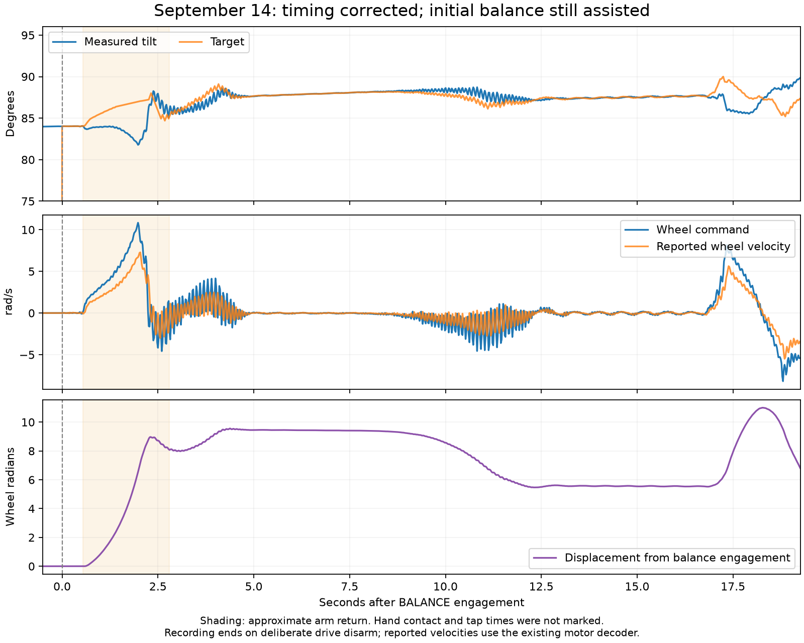

# September 14: slow stand-up diagnosis and receiver timing correction

The latest attempt barely moved because the arm-control loop was repeatedly
stalled in radio receiver processing. Increasing motor speed or balance gains
would not restore those missing control updates.

## Evidence

The [saved attempt](../telemetry_logs/bal_20260914_213606_slow-start-before-fix.csv)
passed both the device-file and USB transport checksum checks. It contains just
20 samples spanning 14.849 seconds, entirely in TIP_UP, ending with
`tip-up timeout / arm tracking`. The run lasted 15.276 seconds. Individual sample
gaps reached 1.228 seconds; the receiver section consumed up to 1,210,924 µs.
The entire control section peaked at 1,211,819 µs. CAN processing peaked at
1,067 µs and radio telemetry transmission at 1,315 µs. The independent 200 Hz
IMU/inner task continued running, so a healthy IMU did not imply healthy arm
control. These profiler values are explicitly scoped to this run.

Each arm update advanced its target by 0.014 radians, appropriate for 0.7 rad/s
at 50 Hz. With updates separated by a second, the result was slow creeping until
the 15-second timeout. Do not replace these steps with large catch-up jumps.

The old receiver loop capped reads at 1,024 bytes but repeatedly called
`available()` and single-byte `read()`. A byte budget did not bound elapsed
time. The log isolates the delay to this function; it does not identify the
precise underlying UART-driver contention mechanism.

## Firmware changes

- Read UART data in blocks of at most 128 bytes using the installed Arduino
  ESP32 2.0.16 nonblocking `read(buffer, size)` overload. Its implementation calls
  `uartReadBytes(..., 0)`. Do not use the timeout-based `readBytes()` overload.
- Retain the 1,024-byte limit and add a 2,000 µs elapsed-time budget, checked
  between blocks with unsigned rollover-safe subtraction. A single driver call
  can exceed that budget; on-device measurements are required. Finish each
  already-read block before yielding, preserving partial frames across updates.
- Allocate a 2,048-byte receive buffer before UART initialization to retain
  bursts between 50 Hz control ticks. At 420 kbaud, the physical maximum is
  approximately 840 bytes per 20 ms interval.
- Reject CRC-valid packets with too little payload for RC channels or link
  statistics. A truncated channel packet must not refresh link freshness or
  change arming/trigger inputs. Accept additional payload fields for protocol
  compatibility. The [TBS CRSF specification](https://github.com/tbs-fpv/tbs-crsf-spec/blob/main/crsf.md)
  defines the 22-byte channel payload, 10-byte link statistics, and extension rule.
- Expose receiver lifetime maximum duration, processed bytes, budget yields and
  channel-frame age through the disarmed `status` command.

Balance gains, arm motion rates, calibration, stored trim and the RS05 startup
fix remain unchanged. Timing must be correct before evaluating another gain
change. This release targets the demonstrated startup delay; it has not yet
established reliable unaided balance or eliminated the earlier initial runaway.

## Validation

The native suite executes the production receiver implementation. It covers
all 16 packed channels, CH11 high/low, fragmented frames, corrupt CRC, short
payloads, invalid lengths/noise, extended packets, link expiry, partial reads,
continuous incoming data, elapsed-time/byte budgets and clock rollover.
A simulated UART reproduces the old per-byte stall: 1,228,800 µs versus 320 µs
with bulk reads. This comparison verifies the implementation change under a
controlled driver model, not an on-device speed claim.

Consolidated checks and flash/live measurements are retained under
`evidence/balance-slow-start/`. The frozen image, hashes and rollback application
are packaged under `artifacts/balance-timing-fix/`; release outcome is recorded
in [current state](progress/CURRENT.md).

## Flashed result and the next physical trial

Source `5368df8290886c4b95052e68e5b40b2465bf1418` was programmed at `0x10000`
and verified by OpenOCD. Application SHA-256:
`154d8fbec14d326eab58db723026148e0e134776d7631b22f645a74c2fa8d229`.
Both groups were disarmed before flashing. Calibration and the pre-test 1.09°
trim were retained. No settings or filesystem image was uploaded.

During the post-flash observation, Austin initiated a test. Before arming,
receiver processing peaked at 486 µs over roughly 44 seconds of uptime with
565,154 received bytes. The observer's disarmed-only assertion therefore stopped
being applicable; its later `status` requests were safely refused during balance.
This was an operator-started trial, not tool-initiated motion or a failed receiver
regression. Live serial evidence is retained.

The [new 1,405-row log](../telemetry_logs/bal_20260914_214925_crsf-timing-fix-assisted.csv)
passed file CRC `0x77D64F12` and transport FNV `0x8115BEE4`. It spans 28.109
seconds and ends with `drive disarmed`. Austin reports a little initial roll-away
requiring a hand, then stable balance, a tap and deliberate motor disable.
This is an assisted recovery and an intentionally ended capture. Contact/release
and tap times were not marked.

| Measurement | Slow attempt before fix | New assisted trial |
|---|---:|---:|
| Logged samples | 20 | 1,405 |
| Sample span | 14.849 s | 28.109 s |
| Maximum receiver section | 1,210,924 µs | 531 µs |
| Maximum sample interval | 1,228 ms | 25 ms |
| 99th percentile sample interval | — | 20 ms |
| Recorded stall events | 15 | 0 |
| Result | Tip-up timeout | BALANCE, then operator disarm |

The new run reaches BALANCE at 8.846 seconds and records another 19.265 seconds
in that state. Inner-loop maximum interval is 5.488 ms; IMU age peaks at 20 ms
with no freshness-fault rows. The corrected timing is demonstrated under actual
stand-up/balance activity, not solely by disarmed checks.

The remaining initial surge is distinct: arm return begins about 0.54 seconds
after engagement. By 2.0 seconds the target has risen to 87.01° while measured
tilt is 81.84°, command is 10.46 rad/s and wheel displacement is 6.74 radians.
Peak command in the first four seconds is 10.84 rad/s and peak reported wheel
velocity is 7.48 rad/s. Timing stays regular throughout. This localizes the next
control investigation to the arm-return/target transition; it does not establish
the right gain change or identify the exact hand-contact time.

Final observed state: IDLE, both groups disarmed, all six motors online with
zero motor errors and zero CAN transmit failures. Existing trim learning saved
2.31° from this trial; no manual calibration or trim reset was made. Receiver
lifetime maximum was 564 µs after more than 2.26 million processed bytes.

Remaining data caveats: motor feedback age reached 145 ms and the CAN receive
miss counter increased to 12,517, so zero transmit errors do not imply lossless
feedback. Investigate receive pressure before assuming all wheel feedback is
fresh. Reported velocity uses the existing motor decoder; RS05-specific scaling
needs review before quantitatively retuning velocity gains. The CSV's build
date/time belongs to an unchanged compilation unit reused by the incremental
build and still says September 13; the verified application hash above identifies
this release. Future build metadata should identify the whole image. Finally,
the host analyzer formerly labeled `sp_offset` as rad/s; its report now correctly
prints degrees. Raw download evidence retains the old report, while
`evidence/balance-slow-start/analysis-after.txt` contains the corrected report.

## Earlier assisted run and USB recovery

The earlier USB transfer was repaired in source `213c9bc` and flashed with
application SHA-256
`0a72f4d040df679f624a0a1b39fda73309f36aea6c8a7c08cf097d5e7d9cf12b`.
Writes now honor USB queue capacity and use a longer timeout only for explicit,
disarmed downloads; host reception drains continuously. The completed
[5,648-row assisted-run download](../telemetry_logs/bal_20260913_230816_rs05-startup-fix-assisted.csv)
passed file CRC `0x251DC7CD` and transport FNV `0x937A55CF`. Its profiler prefix
was collected after reboot and is marked `live`; it is not the old run's
profile. The saved run configuration and samples remain valid.

That run reached BALANCE at 12.526 seconds. The initial surge occurred during
arm return and before ramp completion: reported wheel speed reached about
8.60 rad/s and wheel displacement about 9.91 radians (1.58 wheel revolutions).
This differs from the final July run's strongest post-ramp surge. Austin reported
hand assistance before vertical balance; the intervention time and whether
later balance was fully hands-off are unknown. The recording ended at its
120-second duration limit, not a measured fall. It also contains approximately
1.1-second outer-control gaps, reinforcing the need to fix timing first.
The persisted equilibrium trim moved from about 0.97° to 1.09° during that run.

## Next physical test

Use the [existing channel routine](BALANCE_TESTING.md): arms in the usual
forward starting position while disarmed; CH1/CH2/CH4 neutral; CH7, CH9 and CH10
high; wait two seconds; pulse CH11 high for one second, then low once. Avoid a
double tap. Expect the arms to move at their intended speed again. Use a clear
area and be ready to support/disarm if it starts running away. After the attempt,
support the robot, lower both CH9 and CH10, and keep battery/USB connected to save
and retrieve the automatically recorded data.
