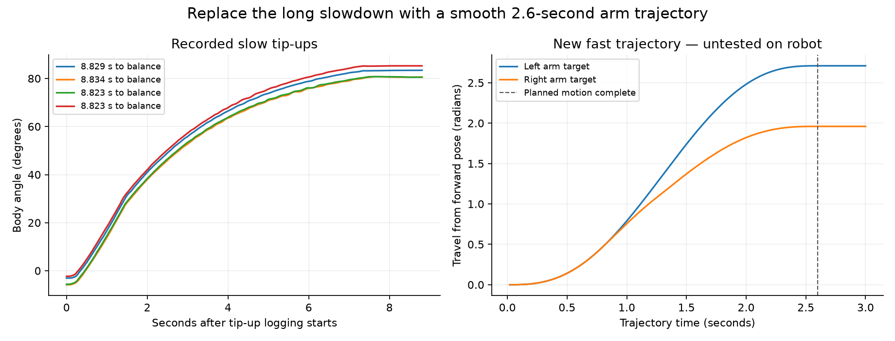

# CH6 fast tip-up — next OTA candidate

September 20, 2026. This change is queued for integration with the lowering
owner's next OTA. It has **not been tested on the robot or installed by this
task**. The current installed source remains identified in the release owner's
[current state](progress/CURRENT.md).

## What the logs say

Four September 20 traces take 8.823–8.834 seconds from their first tip-up sample
to balance engagement. They reach 70° in 4.30–4.90 seconds, then spend several
more seconds approaching the final arm target. The existing arm command is
`0.7 * clamp(distance / 1.5, 0.05, 1)` rad/s for each arm. Its long exponential
tail, ending at only 0.035 rad/s, explains the repeatable delay. This is not a
communications stall in those recordings.

The latest v3 trace starts at −2.301°, reaches balance at 85.258° after 8.823
seconds, and peaks near 30°/s during the slow lift. The right arm carries most
of the load: peak measured torque is about 1.9 Nm across these runs; maximum
target lag is about 0.12 rad on the right versus 0.05 rad on the left.
Those are slow-trial observations, not evidence of fast torque margin.

[Analysis, checksums and replay limits](../evidence/fast-tip-up/analysis.json)
identify all four input files. The latest v3 CSV was read in the lowering
owner's checkout; no source logs were copied between worktrees.

## First fast version

- **CH6 high** (`>0.5`, SB in the last radio audit): experimental fast tip-up.
  **CH6 center or low:** the existing slow routine.
- Select CH6 before the usual single CH11 tap with CH7 and both motor groups
  enabled. Selection is latched when the single-tap request is accepted after
  the existing 500 ms double-tap window. Changing CH6 during a maneuver does
  not change it. CH11 double-tap force-engage and upright CH11 lowering retain
  their existing meanings.
- Fast starts require arms at their calibrated Forward pose (within 0.15 rad),
  a stationary flat body (within 12°), neutral CH1/CH2 and fresh RC/motor/IMU
  data. An unsupported start is refused; it does not silently select slow mode.
- The arm trajectory takes **2.6 seconds**, with zero planned velocity and
  acceleration at both endpoints. It preserves the slow approach's left/right
  geometric relationship through its constant-speed and exponential portions,
  then brings both arms smoothly to the same final tip poses. It removes the
  old minimum-speed tail. The motor speed limit is 2.2 rad/s.
- Before engaging balance, both measured arm positions must be within 0.15 rad
  of the tip pose, both arm speeds at most 0.30 rad/s, body rate at most 8°/s,
  and tilt within the existing engagement window, continuously for 120 ms.
  The production-policy tracking fixtures qualify at 2.72–2.74 seconds.
  **Roughly 3 seconds is the initial lift/capture target.** The 500 ms trigger
  window, motor-mode setup, and subsequent ordinary arm return/settling add
  time; this is not a promise of three seconds from button press to settled
  arms-forward driving.

The shared trajectory pauses if either arm would trail its next target by
more than 0.18 rad, without jumping ahead to catch up elapsed wall time.
Persistent obstruction faults after 400 ms; incomplete capture faults after
4.5 seconds. Lost fresh feedback/RC, a control gap over 40 ms, tilt outside
−20° to 100°, or body rate over 100°/s also faults the fast attempt. Fast tilt
rate checks use the existing 6 ms filter. No automatic retry occurs.

Slow tip-up, arm-return speeds, standing/ground driving, balance gains and
lowering are unchanged. Fast mode does not add a wheel launch pulse or raise
motor current limits.

## Why not one second yet?

For the same 2.71-rad left-arm stroke and smooth profile, one second needs
5.08 rad/s peak planned speed and 15.65 rad/s² peak planned acceleration.
The 2.6-second version needs 1.95 rad/s and 2.31 rad/s² from exact Forward,
so the one-second proposal asks for **6.76 times the acceleration**. Pose
tolerance raises the tested candidate maxima to 2.06 rad/s and 2.44 rad/s².

Replaying historical angle-versus-arm-travel geometry along the fast targets
suggests about 74–76°/s peak body motion. This is a kinematic screen; it omits
inertia, acceleration-induced arm reactions, contact loss, slip and sensor
acceleration bias. It cannot establish successful or gentle fast standing.
Use the first physical fast capture to decide whether to go faster.

## Operator trial after the combined OTA

Use the established [balance test procedure](BALANCE_TESTING.md) and a clear,
restrained test setup. First verify ordinary stand-up with CH6 low. For the
fast comparison, return to the usual flat Forward pose, center CH1/CH2, set
CH6 high, then use one CH11 tap. The operator initiates motion and can support
and disarm promptly if needed. No need to test CH11 lowering in the same run.
Record a side view if available. After disarming both groups, download the
saved run over Wi-Fi before another attempt replaces it.

Logs retain schema 4 / 240-byte samples. Feature bit 16384 identifies fast
tip-up v1 support; `pilot_flags & 128` marks a run that actually selected it.
During those runs' state-1 samples, `roll_rate` is the 6 ms filtered rate;
ordinary balancing still uses its original filter. Versioned metadata is
printed only for matching saved feature bits, so old saved runs remain
correctly described after OTA.

## Integration

Source branch: `codex/fast-tip-up`, based on `400c98d` in
`worktrees/fast-tip-up`. The active lowering task owns the device, shared
progress records, combined validation and next OTA. It reserves feature bit
32768 for lowering v4; combining both changes yields feature flags 65535.
The candidate's configured local build is for validation, not the combined
release image. [Handoff evidence](../evidence/fast-tip-up/README.md) records
checks and the exact integration procedure.
