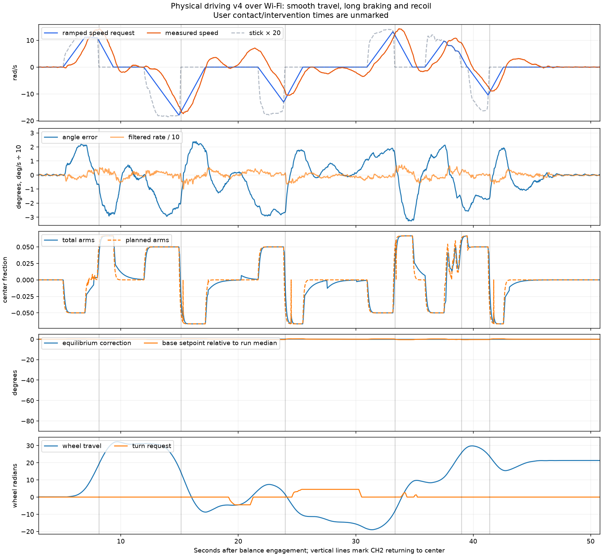
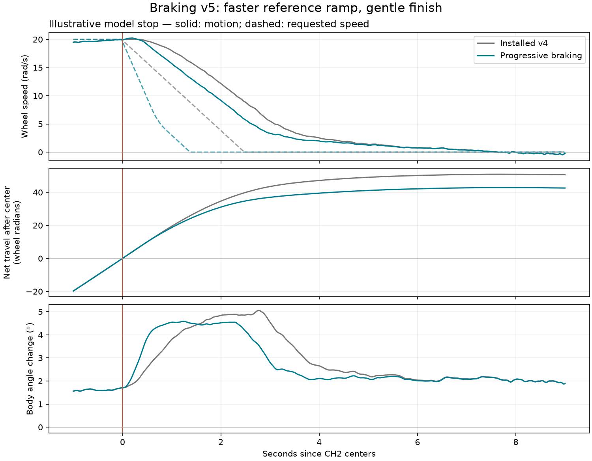

# Progressive braking v5 evidence

See [findings and candidate behavior](../../docs/BALANCE_DRIVE_BRAKING_2026-09.md). The installed v4 run was downloaded and both checksums validated; `info-before.json` identifies that firmware. Braking native/software/model checks and the pinned credentialed build pass. No firmware has yet been deployed by this worktree.

- `analyze.py`, `physical-v4-*`: 2,981-row physical run analysis and plots.
- `ramps.*` / `screen_ramps.py`: ramp-only deceleration screen.
- `capture-screen.*` / `screen_capture.py` / `rejected_stop_capture.h`: rejected early PD handoff; it is absent from production code.
- `boost-screen.*` / `screen_boost.py`: rejected strong additional braking.
- `mild-boost-screen.*` / `screen_mild_boost.py`: milder candidates; gain0.5/limit3 subsequently rejected by the broader disturbance screen.
- `model.py` / `pilot_bridge.cpp`: actual C++ helper bridge, parameter overrides for experiments; defaults use current source. Rejected boost/capture paths are absent from this production bridge.
- `final_screen.py`: exact frozen installed source versus candidate, including neutral/startup regression, forward/reverse, input loss, pushes, and recorded stick replay.

The final candidate uses progressive 8–20rad/s² reference braking and unchanged inner control. `final-stops.*` records the paired 192-case stop comparison. Archived `experiment_model.py`/`experiment_bridge.cpp` and `rejected-*.h` preserve rejected options outside production. Their extra brake defaults to zero unless a screen explicitly enables it; an optional arm cap reproduces that intermediate experiment. The ground-drive fix is integrated. Preserve private Wi-Fi credentials and application-only OTA; never copy the credential file between worktrees or deploy a build using example credentials. This worktree builds with an ignored configuration that adds an include path to the existing private root header. Credentialed binaries, build trees, caches, and that machine-specific configuration are not committed.
