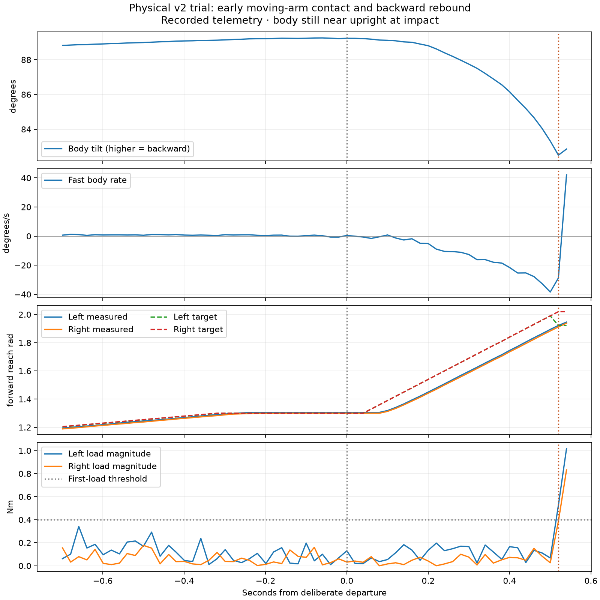

# Physical forward-fall/catch v2 trial: early impact and rebound

Austin reported the arms appeared too far forward before the body committed,
nearly caught it, then bounced it backward. This task retrieved and validated the
latest saved run after fresh disarmed/maintenance preflight. No movement or
settings changes were requested. [analysis.json](analysis.json) records hashes,
timing and derived metrics; [analyze.py](analyze.py) reproduces the analysis/plot.

The immutable CSV and exact wire are
`telemetry_logs/bal_20260920_forward_catch_v2_wifi.csv` and `.wire`: 1,984 samples,
39.760 seconds, schema 4/240 bytes/features 8191, ending `lower_wrong_direction`.
They were exported from installed source `dd74154`, app0 ESP digest
`7668a0215df34b7e5c0030a23705ba8016343260d1e6bab7aacfe202897c7190`.
The saved log build date correctly identifies the changed controller translation
unit; the API's older build-date string comes from an unchanged cached network
translation unit. File hashes and feature metadata are authoritative here.

- CH11 request at 33.196 s; preparation starts 33.685 s.
- At commitment (39.220 s), both arms reached about 1.3 rad and body tilt was
  89.230°, versus 84.623° at the request.
- The fast arm sweep began at 39.280 s: only **0.049°** forward displacement,
  60 ms after commitment. A brief -1.579°/s sample was enough to latch it on.
- At 39.740 s, left torque reached -0.525 Nm and right 0.385 Nm, consistent
  with the reported first impact. Body tilt was still **82.511°**; arms had
  reached about 1.92 rad and were still moving forward at 1.31/1.35 rad/s.
  Left hold latched; right stayed just below the 0.4 Nm threshold and continued.
- Peak pre-impact forward rate reached -38.430°/s. In the final 20 ms,
  measured rate reversed from -28.789 to **+42.163°/s**, with torque magnitudes
  1.018/0.833 Nm. The backward-rate guard then faulted before sustained support
  qualified. The archive ends at the fault, so it does not measure the later fall.

The data support an early moving-arm impact/rebound, not a failure to initiate
forward motion. Contact load thresholds are inferences; no floor contact sensor
or video timestamps are available. The physical cause is consistent with
Austin's observation rather than uniquely proven by current/gyro samples alone.
Controller cadence was healthy: maximum inner interval 5,503 µs, sample interval
24 ms, IMU age 10 ms; rear feedback ages at most 8/2 ms during lowering.

The pinned installed C++ helper reproduces committing → catching →
`lower_wrong_direction` exactly when initialized at the observed committed
posture. A full replay from CH11 does **not** reproduce preparation confirmation:
it misses commitment and would subsequently fault on the logged zero setpoint.
The archive preserves that mismatch. Exported values are rounded, some motor/gyro
fields update between control decisions and logging, and `sample_dt_ms` is not
necessarily the exact decision interval. The segmented replay is therefore
decision evidence, not an exact reconstruction of every internal state or a
simulation of a proposed fix.

Next candidate work: reduce the arm preparation reach, require meaningful
forward departure before fast extension, and screen moving-arm impact/rebound
explicitly. The previous contact model damps body rate without the contact
boundary velocity caused by arm motion, so it understates this failure mode.
Keep successful ground/standing drive unchanged. OTA reliability now has a
separate task/worktree; coordinate the next combined release through the owners.
