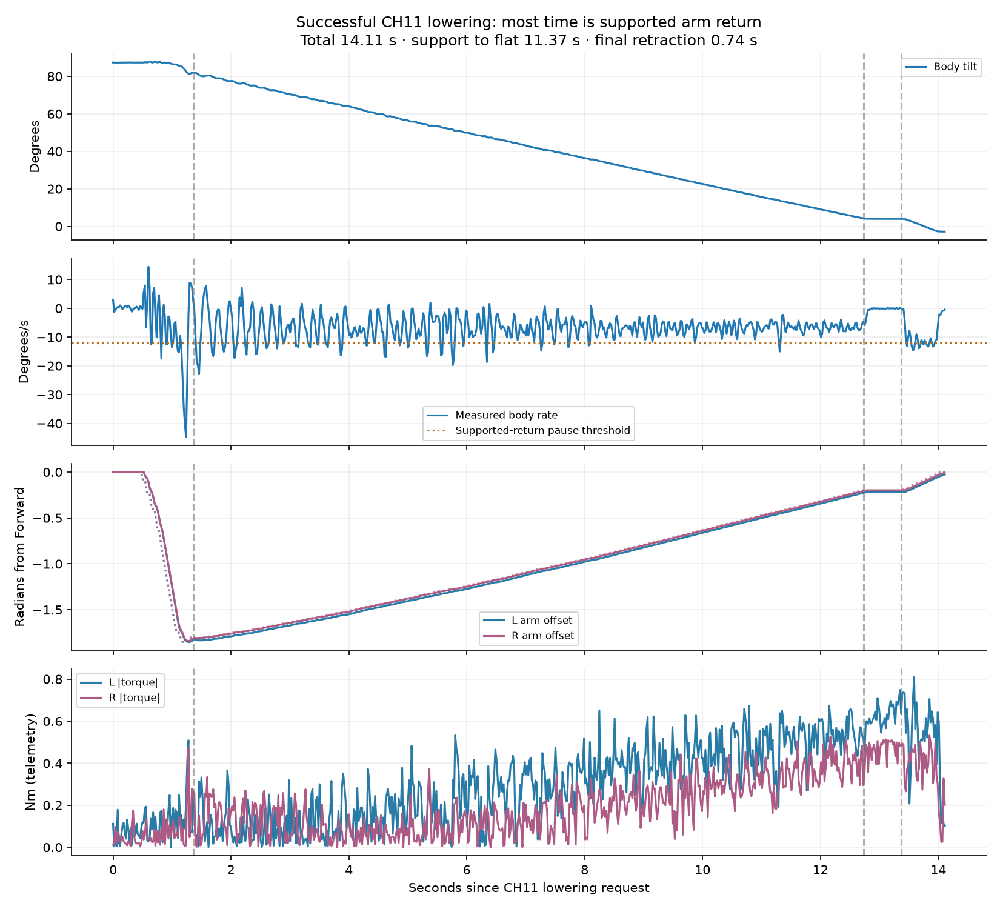

# V7: operator-confirmed fast stand-up and lowering success

Austin reports that both fast stand-up and CH11 laydown worked. Saved source
`c442e1271eaf9f38cfbeab27c2e435fe6b8e3eb3` was verified in app0 before export.
The [preflight](preflight.json), [archive checksums](archive.json) and
[derived analysis](analysis.json) preserve 1,759 rows / 35.195 seconds, schema7,
fast bit128 and end reason `lower_complete`. Raw files remain in this checkout:
`telemetry_logs/bal_20260920_forward_catch_v7_success_wifi.csv` and `.wire`.

Fast capture occurred at 2.890 s, arm/base return completed at 5.131 s and
recovery settled at 6.871 s. This is a second operator-confirmed successful
fast v2 stand-up. Its production policy remains unchanged.

| Lowering event | Run time | Time since request |
| --- | ---: | ---: |
| CH11 request | 21.086 s | 0 s |
| Preparation | 21.565 s | 0.479 s |
| Forward commitment | 22.205 s | 1.119 s |
| Supported return | 22.445 s | 1.359 s |
| First flat qualification | 33.815 s | 12.729 s |
| Final retraction | 34.455 s | 13.369 s |
| Complete | 35.195 s | 14.109 s |

The prior 12.525-second stop delay is gone. Both contacts qualify support and
return continues through the whole descent. Final body tilt is −2.818°,
rate −0.455°/s, rear wheels −0.024/+0.054 rad/s and measured Forward errors
−0.027/+0.007 rad. This agrees with the operator's successful flat finish.



## Speed opportunity and limits

Supported descent takes 11.370 s. Target tracking errors are at most
0.021/0.011 rad; arm torques peak at 0.674/0.526 Nm. Body motion oscillates
through the existing −12°/s return pause, especially shortly after contact.
These measurements support a modest target-speed trial, not removal of that
pause or a mechanical load rating. [V8](../faster-return-v8/README.md) raises
supported target speed 0.16 → 0.24 rad/s while retaining the 0.30 rad/s motor cap.

The final retraction takes only 0.740 s and already reaches −14.560°/s body rate,
with the existing 20°/s ground-instability guard. Its speed remains 0.30 rad/s.
Catch, final flat dwell, measured Forward completion and all global guards
remain unchanged. A single successful lowering does not establish reliability.

Reproduce with the plotting Python environment:

```sh
python scripts/analyze_lower_success.py telemetry_logs/bal_20260920_forward_catch_v7_success_wifi.csv --output evidence/balance-lower/trial-v7-success-20260920 --installed-source c442e1271eaf9f38cfbeab27c2e435fe6b8e3eb3
```
