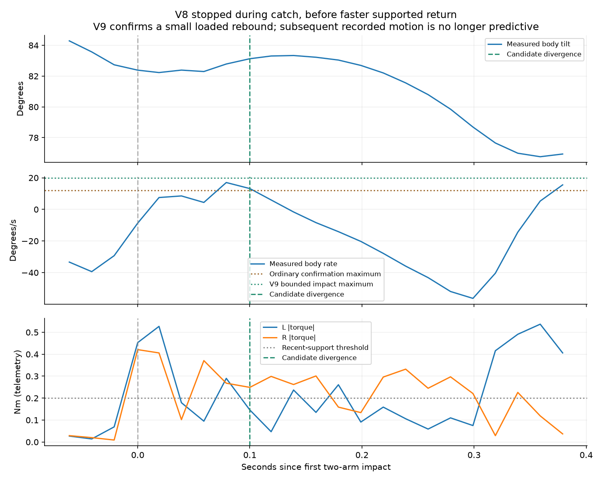

# V8 trial: contact confirmation interrupted by rocking

Archived 662 samples / 13.290 s from installed source `47eb19a`, schema8.
Austin confirmed fast stand-up worked and lowering stopped on the arms.
The run ends `lower_wrong_direction`; it never reaches supported descent,
so the new 0.24-rad/s return speed was never used. [Analysis](analysis.json),
[archive](archive.json), [preflight](preflight.json), [replay script](analyze.py).

Fast capture occurs at 2.890 s. CH11 starts at 11.636 s, preparation at
12.121 s, forward commitment at 12.770 s and catching at 12.870 s.
Both arms contact at 12.911 s. Arm reversal first qualifies at 12.950 s,
but rates +16.999 and +13.180 degrees/s reset the existing +12 limit.
The body rises less than one degree from its impact minimum during that
interruption. A later rebound at 13.290 s falls outside the 300 ms impact
grace and stops lowering. The robot is still supported upright.

V9 permits the support dwell to continue through a bounded loaded rebound:
at most +20 degrees/s, at most 1.5 degrees above the minimum tilt since
impact, within the existing first-impact 300 ms window. Both recent arm
loads, measured reversal velocities and the full 80 ms confirmation remain.
Fixed-input replay reproduces the installed fault and places candidate
support confirmation / first command divergence at 13.011 s. If supplied
unchanged later sensors, the candidate still rejects support loss at
13.210 s. Those later sensors are not a prediction after changed motor
commands; the support-loss guard is intentionally preserved.

The previous successful recording yields identical v8/v9 commands and
phase events in replay. This is a regression check, not a prediction of
physical duration or proof that the new catch will complete. See the
[policy/model record](../bounded-catch-v9/README.md) and
[operator procedure](../../../docs/BALANCE_TESTING.md).
