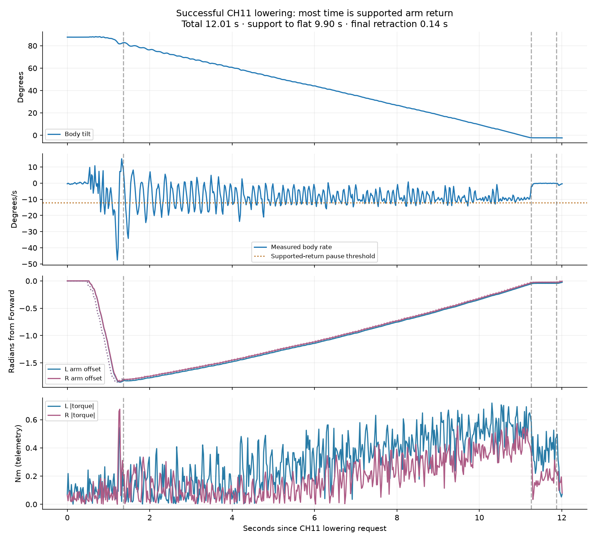

# V9 success: fast lift and complete supported lowering

Austin confirmed both maneuvers worked. Archived 1,462 samples / 29.750 seconds
from source `b9763c2`, schema9, ending `lower_complete`.
[Analysis](analysis.json), [archive](archive.json), [preflight](preflight.json).
Reproduce with `scripts/analyze_lower_success.py` and the recorded source ID.

Fast lift captures at 3.026 seconds and completes arm return at 5.296 seconds.
CH11 starts at 17.741 seconds; preparation takes 0.630 seconds after a 0.485-second
stop. Forward commitment to support takes 0.245 seconds. Supported descent
then takes 9.900 seconds, flat dwell 0.610 seconds and final retraction just
0.139 seconds. Total lowering is 12.009 seconds.

Final tilt is -2.368 degrees, body rate -0.396 degrees/s, Forward errors
-0.025/+0.005 rad and rear wheel speeds +0.018/-0.021 rad/s. Maximum supported
arm tracking error is 0.025/0.016 rad. The return-rate gate pauses on 116 of
488 supported samples; body rate briefly reaches -34.209 degrees/s. These
oscillations make a separate fast rate schedule relevant, not just a higher
arm motor cap. [V10](../fast-return-v10/README.md) preserves this normal behavior
and introduces fast supported return selected at the lowering request.

One success establishes a useful baseline, not a reliability rate or mechanical
load rating. No autonomous motion was performed to obtain this capture.
