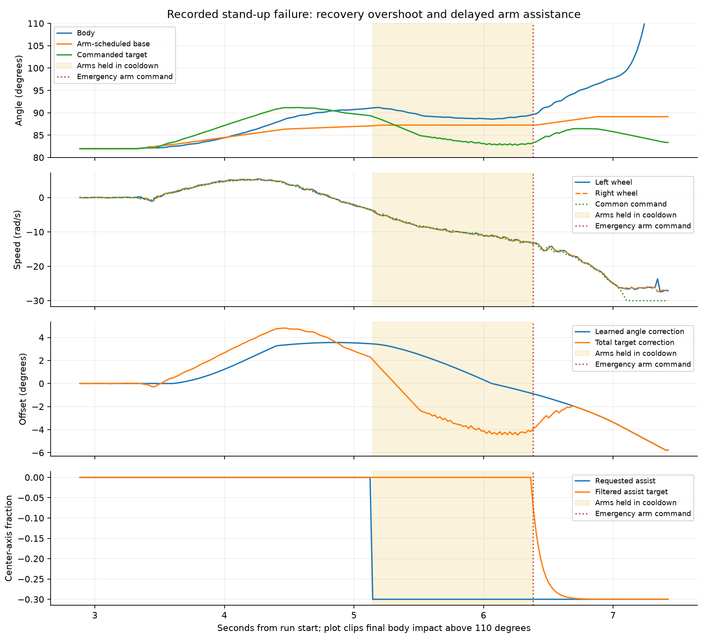
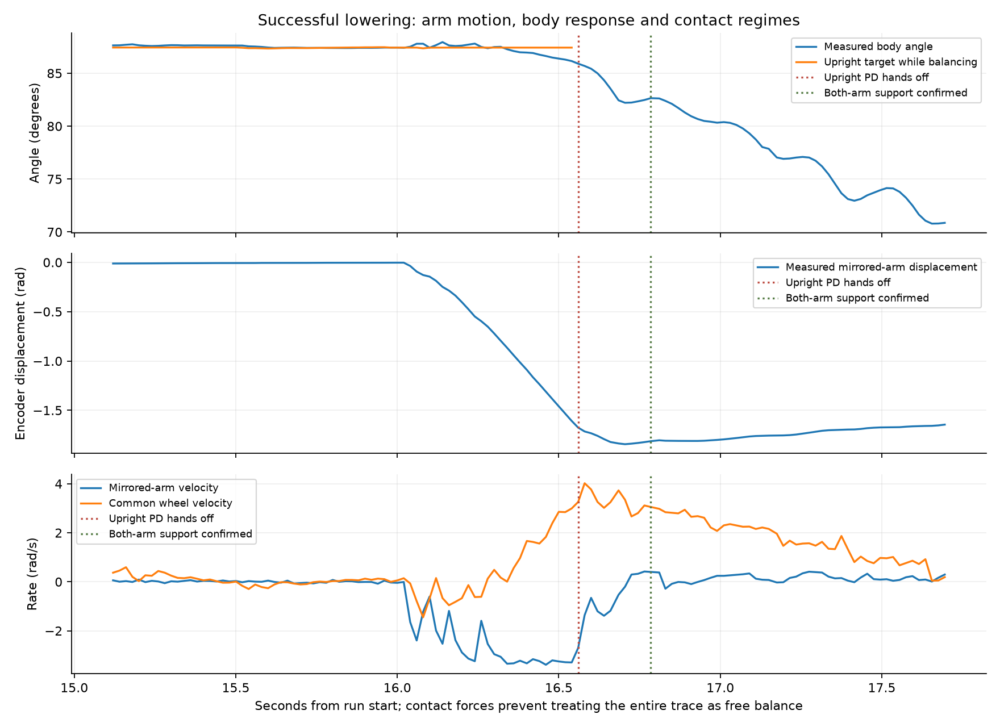

# Stand-up roll-away: arm and wheel recovery investigation

Status: investigation complete; **no motion-controller change accepted or uploaded**.
Installed firmware remains lowering v13 / fast stand-up v2, source
`7c32bd7a6e48e641345a7fbc067a11d46a0643bf`, app0, ESP digest
`2cba5a84594a703bb377b6697791fca4da790e8b6c8d4fe5ddf0f2181461cdae`.
Work is isolated to the `codex/balance-lower` checkout. Other task source and the
robot's settings were not changed. The failed run was archived while disarmed;
no motor motion or OTA was initiated for this investigation.

## What the physical run establishes

The [372-row archive](../../balance-lower/standup-rollaway-20260921T023411Z/)
ends at 7.424 s with `bailout_angle_error`. CSV SHA256:
`c2ee34b480f8cc5f801b8e3d7d0ac431989aa184202493c8df4548fb886b3bc4`.
Original wire SHA256:
`48712f4fe2b691cebd3586ba6c8551de94d6a88f5ef8cf7ab651d585d875b09e`.
[Analysis and reference runs](observed.json) retain the source identities and
exact event samples. [analyze.py](analyze.py) reproduces the measurements/plots.

| Run time | Observed event |
| --- | --- |
| 2.885 s | Supported upright capture at 81.965 degrees. |
| 3.305 s | Arms begin returning. Stored trim remains +3.2398 degrees. |
| 3.625 s | Existing startup detector catches the first roll-away. |
| 4.844 s | Learned correction reaches +3.5579 degrees. |
| 5.145 s | Arm/base ramp completes; body91.074 degrees, wheel command−3.754rad/s. Full negative arm demand−0.30 is present, but arms remain in COOLDOWN. |
| 6.384 s | Emergency finally enables arms at command−13.598rad/s. |
| 7.105 s | First logged inner speed saturation. |
| 7.424 s | Angle-error bailout. |

For **62 samples / 1.239 s** after ramp completion, arm demand is fully negative
but COOLDOWN blocks it. Calm time stays zero: the speed already exceeds the
rearming threshold. This is a state-machine gap after confirmed startup
recovery, rather than slow filtering of the requested assist. The ordinary
assist filter is 20 ms. `arm_assist_vel` is wheel-error filtering, not physical
arm angular velocity.

Once commanded, the measured arms respond; the initial problem is not failure
to execute the arm command. At ramp completion the arms still have residual
return velocity (left−1.395/right−0.637rad/s), so a replacement handoff must also
coordinate measured arm motion before reversing their trajectory. Globally
removing cooldown would reintroduce the earlier idle-oscillation problem.

The wheels track together before the large fall (left/right command-tracking
RMS≈0.46/0.47rad/s in the documented selection). No dead-man, IMU-stale or CAN
transmit fault appears. Maximum inner interval5.493ms, owner age19ms, wheel
feedback age17ms. This differs from the earlier unilateral wheel-tracking
failure; terminal mismatch after saturation does not establish the same cause.



## A wrong balance angle is possible, but not identified

There are **zero quiet Forward-equilibrium samples** in this failure. The
81.965-degree capture is arm-supported and must not become a permanent Forward
calibration. The previous successful run's quiet Forward median is87.275 degrees;
the current nominal Forward target is87.240 degrees. That agreement is useful
context, not proof that the current true equilibrium is unchanged.

Transient integral learning contributes a large correction before reversal.
It is already negative by6.084s while backward speed continues increasing.
Changing a fixed trim alone therefore does not address the demonstrated
recovery/lifecycle problem. Accelerometer-derived angle changes sharply during
the emergency swing; specific-force contamination is plausible, but independent
attitude/contact truth is absent. We cannot assign the fall solely to calibration,
IMU drift, arm inertia or an external floor effect.

## Arms require both static and dynamic treatment

The installed code schedules equilibrium from **measured arm position** along
separate tip and center axes. Its center slope is−6.3 degrees per fraction;
full negative assistance nominally shifts the Forward equilibrium +1.89 degrees.
The base target slews at4 degrees/s. There is no explicit arm angular-acceleration
reaction term in the wheel controller.

The successful lowering trace shows the joint response clearly. Arm movement
begins while upright PD still owns the wheels; the body responds, the wheel
speed changes, then upright PD hands off at16.560s and both-arm support is
confirmed at16.785s. From that point floor contact contributes forces and
moments. The whole lowering trace cannot be treated as a free-balancing inertia
calibration. The stored scheduled-base values are predictions, not measurements
of actual center of mass.



A useful recovery model needs separate terms for gravity/equilibrium versus
arm pose, wheel acceleration, and reaction to arm acceleration. Servo lag,
remaining arm travel, wheel speed headroom, and contact regime matter too.
Austin's arm-inertia observation is incorporated explicitly in the second
screen below; its coefficients are hypotheses, not fitted physical constants.

## Offline experiments and rejected shortcuts

[screen.py](screen.py) bridges the actual installed C++ `BalanceDrive` and rate
filter through [bridge.cpp](bridge.cpp), with gains read from `config.h`.
The outer loop remains the existing approximate Python model. Fast supported
capture/monotonic release are represented explicitly, and an idealized support
constraint is retained. All policies use the same plant/noise within each pair.
No trace replay here establishes a physical counterfactual rescue.

The wheel prototype enables the existing acceleration controller at detected
startup recovery, removes the parallel velocity-P lean demand, and uses ordinary
0.231 integral gain instead of the transient1.0 boost. The latched variant stays
in acceleration control after settling. The arm prototype makes ordinary assist
READY once after ramp completion during active recovery. It is deliberately a
simple ablation, **not** the recommended synchronized handoff.

| Approximate planar policy | No model fall /385 | Baseline passes that regress |
| --- | ---: | ---: |
| Installed policy | 114 | — |
| Acceleration during recovery, then handoff | 272 | 8 |
| Acceleration retained after recovery | 272 | 8 |
| Earlier ordinary arms alone | 89 | 35 |
| Retained acceleration + earlier arms | 273 | 8 |

The eight regressions for retained acceleration occur with150ms first-order
motor lag. That does not certify faster plants: the model omits other relevant
dynamics, and the nominal case does not reproduce the observed physical fall.
Only2/385 installed-policy cases have final wheel-speed RMS below0.7rad/s, versus
223/385 for retained acceleration. These are sensitivity results, not predicted
physical success rates or full-state settling guarantees.

The second screen adds a causal position-servo plant with bounded acceleration
and lag, plus an explicit hypothesized inertial reaction from mirrored-arm
acceleration. Inertia ratios0/0.05/0.15, arm lag10/40ms and acceleration30/80rad/s²
are crossed with uncertain gravity, wheel coupling, motor lag and equilibrium.
The reaction sign follows an assumed mechanical interpretation of the mirrored
encoder axis and must be verified before using feedforward. This is a planar
sensitivity model, not a full multibody/contact simulator.

| Dynamic-arm policy | No model fall /648 | Baseline passes that regress |
| --- | ---: | ---: |
| Installed policy | 193 | — |
| Earlier ordinary arms alone | 208 | 44 |
| Retained acceleration + earlier arms | 250 | 61 |

The dynamic-arm results rule out treating an aggregate improvement as sufficient
validation. Neither simply enabling arms sooner nor transplanting the driving
controller is ready for OTA. Complete case parameters, failure classifications,
regression IDs and source hashes are retained in `planar-screen.json` and
`dynamic-screen.json`. Arm return/assist lag and inertial coupling materially
change the conclusions. Existing lowering/standing-driving runtime remains
untouched.

## Recommended implementation boundary

1. Add a dedicated, bounded startup-recovery owner after confirmed runaway.
   Handoff must use both measured arm positions and velocities with fresh
   feedback; a target-arrival flag alone is insufficient. Give it one coordinated
   catch/relax opportunity, keeping ordinary cooldown for idle balance.
2. Stabilize tilt and tilt rate with wheel acceleration while budgeting wheel
   speed headroom. Evaluate velocity trend and worsening lean early, rather than
   waiting for the current13.5rad/s emergency threshold. Retain asymmetric-wheel,
   stale-feedback, deadline, travel and saturation fault guards.
3. Plan the arm trajectory with acceleration limits. Represent its pose-dependent
   equilibrium separately from its transient reaction on the body. Coordinate
   wheel acceleration with that reaction only after sign/gain/latency uncertainty
   is bounded; do not feed an unverified inertia estimate into production.
4. Separate slow equilibrium learning from capture, arm transients and floor
   contact. Learn from qualified free-balancing data; do not relabel a recovery
   correction or supported capture as persistent balance trim.
5. Compare against successful stand-ups, both wheel directions, recoil, motor lag,
   arm tracking/latency, stale feedback, contact and saturation. Reject unexplained
   regressions, then freeze/build once and run an operator-controlled physical
   trial before any claim of improved reliability.

Next engineering action is a bounded synchronized recovery prototype with a
measured/uncertain arm-reaction model, not another trim-only tuning release.
Additional instrumentation should expose measured center-axis velocity, arm
feedback age, readiness/rejection reasons and recovery headroom. The evidence
here does not show that the exact failed run was recoverable by any tested
candidate; it shows an earlier intervention opportunity and why the first
shortcuts are insufficient.

## Reproduce and verification

From this checkout, with Python supporting matplotlib:

```sh
python evidence/balance-recovery/rollaway-20260921/analyze.py
python evidence/balance-recovery/rollaway-20260921/screen.py
python evidence/balance-recovery/rollaway-20260921/screen.py --dynamic-arms
```

The two screens execute1,925 and1,944 modeled episodes respectively. The bridge
compiles with C++17 and `-Wall -Wextra -Werror`. Python syntax, artifact identity,
output completeness, plots and focused existing balance-drive/math tests are
checked. Firmware is unchanged, so no ESP32 rebuild or OTA is required for
this investigation. Independent read-only fast-tip task review confirms the
cooldown gap, residual return velocity and angle-identification limits.
